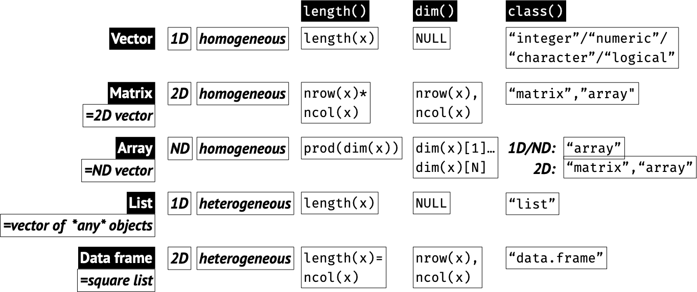

# Data Structures {#structures}

```{r echo = FALSE}
knitr::opts_chunk$set(fig.width = 10, fig.height = 5,
                      comment = NA, cache = TRUE) 
options(rt.theme = "lightgrid")
options(rt.fit.theme = "lightgrid")
```

```{r, comment="", results="asis", echo=FALSE}
old.hooks <- fansi::set_knit_hooks(knitr::knit_hooks)
options(crayon.enabled = TRUE)
```

There are 5 main data structures in R:  

* Vector: 1-dimensional homogeneous collection
* Matrix: 2-dimensional homogeneous collection
* Array: N-dimensional homogeneous collection
* List: 1 main dimension, but can be nested; heterogeneous collection
* Data frame: 2-dimensional: A special type of list; heterogeneous collection of columns

Homogeneous vs. hetereogeneous refers to the kind of data types (integer, double, character, logical, factor, etc.) that a structure can hold. This means a matrix can hold only numbers or only characters, but a data frame can hold different types in different columns. That is why data frames are very popular data structure for statistical work.

```{r FigRDataStructures, echo = FALSE, fig.cap = "R Data Structure summary. Read through chapter and refer back to this figure."}

```

```{block, type="Info"}
**Check object class with `class()` and/or `str()`.**
```

## Vectors

```{r}
(x1 <- c(1, 3, 5, 7))
class(x1)
typeof(x1)
```

```{r}
(x2 <- 1:10)
(x3 <- rnorm(10))
(x4 <- seq(0, 1, .1))
seq(10)
(x5 <- sample(seq(100), 20))
```

### Generating sequences with `seq()`

1. from, to, by

```{r}
seq(1, 10, .5)
```

2. 1:n

```{r}
(seq(12))
(seq_len(12))
```

3. Along the length of another object

```{r}
seq_along(iris)
1:ncol(iris)
```

4. `from`, `to` with length `n`

```{r}
seq(-5, 12, length.out = 11)
```

### Initializing a vector

```{r}
x <- vector(length = 10)
x <- vector("numeric", 10)
x <- vector("list", 10)
```

## Matrices

```{r}
x <- matrix(sample(seq(1000), 30), nrow = 10, ncol = 3)
x
class(x)
```

### Construct by row or by column

By default, vectors are constructed by column (byrow = FALSE)

```{r}
x <- matrix(1:20, nrow = 10, ncol = 2, byrow = FALSE)
x
```

```{r}
x <- matrix(1:20, nrow = 10, ncol = 2, byrow = TRUE)
x
```

### Initialize a matrix

```{r}
(x <- matrix(NA, nrow = 6, ncol = 4))
(x <- matrix(0, nrow = 6, ncol = 4))
```

### Bind vectors by column or by row

Use `cbind` ("column-bind") to convert a set of input vectors to columns of a **matrix**. The vectors must be of the same length:

```{r}
x <- cbind(1:10, 11:20, 41:50)
x
class(x)
```

Similarly, you can use `rbind` ("row-bind") to convert a set of input vectors to rows of a **matrix**. The vectors again must be of the same length:

```{r}
x <- rbind(1:10, 11:20, 41:50)
x
class(x)
```

## Lists

To define a list, we use `list()` to pass any number of objects.  
If these objects are passed as named arguments, the names will rename as element names:

```{r}
x <- list(one = 1:4,
          two = sample(seq(0, 100, .1), 10),
          three = c("mango", "banana", "tangerine"),
          four = median)
class(x)
str(x)
```

### Nested lists

Since each object can be anything at all, it is simple to build a nested list:

```{r}
x <- list(alpha = letters[sample(26, 4)],
          beta = sample(12),
          gamma = list(i = rnorm(10),
                       j = runif(10),
                       j = seq(0, 1000, length.out = 10)))
x
```


### Initialize a list

```{r}
x <- vector("list", 4)
x
```

##  Data frames

```{block, type="Note"}
Data frames are specialized lists where each element = column has the same length, but, unlike matrices, each column can contain a different data type.
```

```{r}
x <- data.frame(Feat_1 = 1:5,
                Feat_2 = rnorm(5),
                Feat_3 = paste0("rnd_", sample(seq(100), 5)))
x
class(x)
str(x)
class(x$Feat_1)
```

```{r}
mat <- matrix(1:100, 10)
length(mat)
df <- as.data.frame(mat)
length(df)
```

## Arrays

### 1D array

It is very unlikely you will need to use a 1D array: it is essentially a vector but of class `array`:

```{r}
x <- 1:10
xa <- array(1:10, dim = 10)
class(x)
is.vector(x)
class(xa)
is.vector(xa)
```

### 2D array

A 2D array is a matrix:

```{r}
x <- array(1:40, dim = c(10, 4))
class(x)
dim(x)
```

### ND array

You can build an N-dimensional array:

```{r}
(x <- array(1:60, dim = c(5, 4, 3)))
class(x)
```
You can provide names for each dimensions using the `dimnames` argument. It accepts a list where each elements is a character vector of legth equal to the dimension length. Using the same example as above, we pass three character vector of length 5, 4, and 3 to match the length of the dimensions:

```{r}
x <- array(1:60,
            dim = c(5, 4, 3),
            dimnames = list(letters[1:5],
                            c("alpha", "beta", "gamma", "delta"),
                            c("x", "y", "z")))
```

3D arrays can be used to represent color images. Here, just for fun, we use `rasterImage` to show how you would visualize such an image:

```{r}
x <- array(sample(1:255, 432, TRUE), dim = c(12, 12, 3))
par("pty")
par(pty = "s")
plot(NULL, NULL,
     xlim = c(0, 100), ylim = c(0, 100),
     axes = F, ann = F, pty = "s")
rasterImage(x/255, 0, 0, 100, 100)
```

## Attributes

R objects may have some builtin attributes but you can add arbitrary attributes to any R objects. These are used to store additional information, sometimes called metadata, about an object.  

### Read attributes

To read an object's attributes, use `attributes`:

```{r}
attributes(iris)
```

This returns a named list. In this case we got names, class, and row.names of the iris data frame.  

### Add attributes

You can assign new attributes using `attr`:

```{r}
(x <- c(1:10))
attr(x, "name") <- "Very special vector"
```

Printing the vector after adding a new attribute, prints the attribute name and value underneath the vector itself:

```{r}
x
```

Our trusty `str` function will print attributes as well

```{r}
str(x)
```

### Common builtin attributes

Vectors can have named elements. A new vector has no names, but you can add them:

```{r}
x <- rnorm(10)
names(x)
names(x) <- paste0("Value", seq(x))
x
```

Matrices and data frames can have column names (`colnames`) and row names (`rownames`):

```{r}
x <- matrix(1:15, 5)
colnames(x)
rownames(x)
colnames(x) <- paste0("Feature", seq(3))
rownames(x) <- paste0("Case", seq(5))
x
```

Lists are vectors so they have `names`. These can be defined when a list is created using the name-value pairs or added/changed at any time.

```{r}
x <- list(HospitalName = "CaliforniaGeneral",
          ParticipatingDepartments = c("Neurology", "Psychiatry", "Neurosurgery"),
          PatientIDs = 1001:1253)
names(x)
```

Add/Change names:

```{r}
names(x) <- c("Hospital", "Departments", "PIDs")
x
```

Remember that data a frame is a special type of list. Therefore in data frames `colnames` and `names` are equivalent:

```{r}
colnames(iris)
names(iris)
```

Note: As we saw, matrices have `colnames` and `rownames.` Using `names` on a matrix will assign names to *individual elements*, as if it was a long vector - this is not usually very useful.
