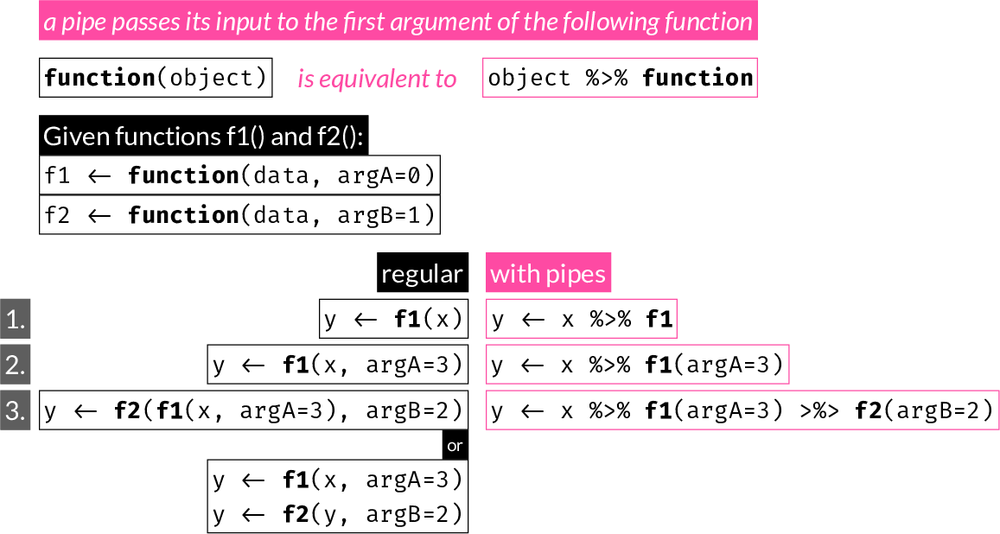

# Functions {#functions}

```{r echo = FALSE}
knitr::opts_chunk$set(fig.width = 10, fig.height = 5,
                      comment = NA, cache = TRUE) 
```

Writing functions is a core part of programming.

*When should you write a function?*

Whenever you find yourself repeating pieces of code.

*Why is it important?*

Writing functions helps reduce the total amount of code, which increases efficiency, reduces the 
chance of error, and can make code more readable.  

Functions in R are "first-class objects".  
This means they can be passed in and out of other functions or objects like any other R structure.  
For example, you can use a command like `apply(mat, 2, mean)`   

Functions in R are *for the most part* like mathematical functions: they have one or more inputs and 
one output. The inputs are known as the function arguments. If you want to return multiple outputs, 
you can return a list containing any number of R objects.


## Simple functions

Let's start with a very simple function: single argument with no default value:

```{r}
square <- function(x) {
  x^2
}

square(3)
```

Notice above that `x^2` is automatically returned by the function. It is the same as explicitly returning it with `return()`:

```{r}
square <- function(x) {
  out <- x^2
  return(out)
}

square(4)
```

which is the same as:

```{r}
square <- function(x) {
  out <- x^2
  out
}

square(5)
```

A function returns either:

- an object passed to `return()`
- the value of the last expression within the function definition such as `out` or `x^2` above.

`return()` is a way to end evaluation early:

```{r}
square.pos <- function(x) {
  if (x > 0) {
    return(x^2)
  } else {
    x
  }
  cat("The input was left unchanged\n")
}

x <- sample(-10:10, 1)
x
square.pos(x)
```

Multiple arguments, with and without defaults:

```{r}
raise <- function(x, power = 2) {
  x^power
}

x <- sample(10, 1)
x
raise(x)
raise(x, power = 3)
raise(x, 3)
```

## Argument matching

R will match unambiguous abbreviations of arguments:

```{r}
fn <- function(alpha = 2, beta = 3, gamma = 4) {
  alpha * beta + gamma
}
fn(g = 2)
```

## Arguments with prescribed set of allowed values

You can match specific values for an argument using `match.arg()`:

```{r error = TRUE}
myfn <- function(type = c("alpha", "beta", "gamma")) {
  type <- match.arg(type)
  cat("You have selected type '", type, "'\n", sep = "")
}

myfn("a")
myfn("b")
myfn("g")
myfn("d")
```

Above you see that partial matching using `match.arg()` was able to identify a valid option, and when there was no match, an informative error was printed.

Partial matching is also automatically done on the argument names themselves, but it's important to avoid depending on that. 

```{r}
adsr <- function(attack = 100,
                 decay = 250,
                 sustain = 40,
                 release = 1000) {
  cat("Attack time:", attack, "ms\n",
      "Decay time:", decay, "ms\n",
      "Sustain level:", sustain, "\n",
      "Release time:", release, "ms\n")
}

adsr(50, s = 100, r = 500)
```

## Passing extra arguments to another function with the `...` argument

Many functions include a `...` argument at the end. Any arguments not otherwise matched are collected there. A common use for this is to pass them to another function:

```{r}
cplot <- function(x, y,
                  cex = 1.5,
                  pch = 16,
                  col = "#18A3AC",
                  bty = "n", ...) {
  plot(x, y, cex = cex, pch = pch, col = col, bty = bty, ...)
                  }
```

`...` is also used for variable number of iputs, often as the first argument of a function. For example, look at the documentation of `c`, `cat`, `cbind`, `rbind`, `paste`  

Note: Any arguments after the `...`, **must** be named fully, i.e. will not be partially matched.

## Return multiple objects

R function can only return a single object. This is not much of a problem because you can simply put any collection of objects into a list and return it:

```{r}
lfn <- function(x, fn = square) {
  xfn <- fn(x)
  
  list(x = x,
       xfn = xfn,
       fn = fn)
}

lfn(3)
```

## Warnings and errors

You can use `warning("some warning message")` at any point inside a function to produce a warning message during execution. The message gets printed to the R console, but function execution is **not** stopped.  

On the other hand, you can use `stop("some error message")` to print an error message to console and stop function execution.

The following function (`el10`) calculates:
$$ e^{log_{10}(x)} $$

```{r}
el10 <- function(x) {
  exp(log10(x))
}
```

which is not defined for negative `x`. In this case, we could let R give a warning when it tries to compute `log10(x)`:

```{r}
val1 <- el10(-3)
```

We could instead produce our own warning message:

```{r}
el10 <- function(x) {
  if (x < 0) warning("x must be positive")
  exp(log10(x))
}
val2 <- el10(-3)
val2
```

As you see, the output (`NaN`) still gets returned.

Alternatively, we can use `stop()` to end function execution:

```{r error=TRUE}
el10 <- function(x) {
  if (x < 0) stop("x must be positive")
  exp(log10(x))
}
val3 <- el10(-3)
```

Note how, in this case, function evalutation is stopped and no value is returned.

## Scoping

Functions exist in their own environment, i.e. contain their own variable definitions.

```{r}
x <- 3
y <- 4
fn <- function(x, y) {
  x <- 10*x
  y <- 20*y
  cat("Inside the function, x = ", x, " and y = ", y, "\n")
}

fn(x, y)
cat("Outside the function, x = ", x, " and y = ", y, "\n")
```

However, if a variable is referenced within a function but no local definition exists, the interpreter will look for the variable at the parent directory. It is best ensure all objects needed within a function are specified as arguments and passed appropriately when the function is called.  

In the following example, `x` is only defined outside the function definition, but referenced within it.

```{r}
x <- 21

itfn <- function(y, lr = 1) {
  x + lr * y
}

itfn(3)
```

### function vs. for loop

Let's z-score the built-in `mtcars` dataset once with a for loop and once with a custom function. This links back to the example seen earlier in the [for loop](#fordata) section. In practice, this would be performed with the `scale()` command:

Within the for loop, we are assigning columns directly to the object initialized before the loop. 
In the following example, we use `print(environment())` to print the environment outside and inside the loop function to show that it is the same. This is purely for demonstration:

```{r}
# initialize new object 'mtcars_z'
mtcars_z <- mtcars
cat("environment outside for loop is: ")
print(environment())

# z-score one column at a time in a for loop
for (i in 1:ncol(mtcars)) {
  mtcars_z[, i] <- (mtcars[, i] - mean(mtcars[, i])) / sd(mtcars[, i])
  cat("environment inside for loop is: ")
  print(environment())
}
```

In contrast, all operations remain local within a function and the output must be returned:

```{r}
ztransform <- function(x) {
  cat("environment inside function body is: ")
  print(environment())
  z <- as.data.frame(sapply(mtcars, function(i) (i - mean(i))/sd(i)))
  rownames(z) <- rownames(x)
  z
}
mtcars_z2 <- ztransform(mtcars)
cat("environment outside function body is: ")
print(environment())
```

Notice how the environment outside and inside the loop function is the same, it is the Global environemnt, but the environment within the function is different. That is why any objects created or changed within a function must be returned if we want to make them available.

## The pipe operator {#pipe}

```{r FigRpipes, echo = FALSE, out.width = "80%", fig.align = 'center', fig.cap = "Illustration of pipes in R"}

```

A pipe operator was first introduced to R with the [magrittr](https://magrittr.tidyverse.org/) 
package with the `%>%` symbol. Note that a number of other packages that allow or endorse the use of pipes export the pipe operator as well.  

Starting with R version 4.1, a native pipe operator is included in the language with the `|>` symbol.

A pipe allows writing `f(x)` as `x |> f()` (native pipe) or `x %>% f` (magrittr). 
Note that the native pipe requires parentheses, but magrittr works with or without them.

A pipe is often used to:

- avoid multiple temporary assignments in a multistep procedure, or 
- as an alternative to nesting functions. 

Some packages and developers promote its use, other discourage it. You should try and see if/when it suits your needs.

The following:

```{r eval = FALSE}
x <- f1(x)
x <- f2(x)
x <- f3(x)
```

is equivalent to:

```{r eval = FALSE}
x <- f3(f2(f1(x)))
```

is equivalent to:

```{r eval = FALSE}
x <- x |> f1() |> f2() |> f3()
```

```{r}
iris[, -5] |>
  split(iris$Species) |>
  lapply(function(i) sapply(i, mean))
```

Pipes are used extensively in the [tidyverse](https://www.tidyverse.org) packages.  
You can learn more about the magrittr pipe operator in the [vignette](https://cran.r-project.org/web/packages/magrittr/vignettes/magrittr.html)

```{block, type="rmdtip"}
In [RStudio](https://rstudio.com/) the keyboard shortcut for the pipe operator is `Shift Command M` (MacOS) or `Ctrl Shift M` (Windows)
```
