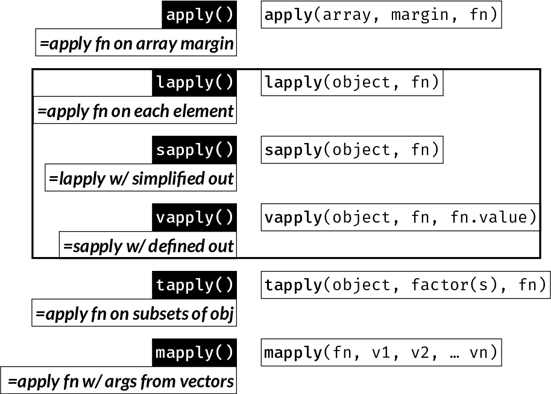

# Loop Functions {#loopfns}

```{r echo = FALSE}
knitr::opts_chunk$set(fig.width = 10, fig.height = 5,
                      comment = NA, cache = TRUE) 
```

Loop functions are some of the most widely used R functions. They replace longer expressions created with a `for` loop, for example.  
They can result in more compact and readable code and are often faster to execute than a `for` loop.  

* `apply()`: Apply function over array margins (i.e. over one or more dimensions)
* `lapply()`: Return a *list* where each element is the result of applying a function to each element of the input
* `sapply()`: Same as `lapply()`, but returns the simplest possible R object (instead of always returning a list)
* `vapply()`: Same as `sapply()`, but you pre-specify the return type: this is safer and may also be faster
* `tapply()`: Apply a function to elements of groups defined by a factor
* `mapply()`: Multivariate version of `sapply()`: Apply a function using the first elements of the inputs vectors, then using the second, third, and so on

```{r FigRapplyfam, echo = FALSE, out.width = "100%", fig.align = 'center', fig.cap = "`*apply()` function family summary (Best to read through this chapter first and then refer back to this figure)"}

```

Before starting to use the above functions, we need to learn about anonymous functions, which are often used within the apply functions.

## `apply()` {#apply}

```{block, type="rmdtip"}
`apply()` applies a function over one or more dimensions of an array of 2 dimensions or more (this includes matrices) or a data frame:

`apply(array, MARGIN, FUN)`
```

`MARGIN` can be an integer vector or character indicating the dimensions over which 'FUN' will be applied.

By convention, rows come first (just like in [indexing](#indexing)), therefore:  
`MARGIN = 1`: apply function on each ***row***
`MARGIN = 2`: apply function on each ***column***


Let's calculate the mean value of each of the first four columns of the iris dataset:

```{r}
x <- iris[, -5]
iris_column_mean <- apply(x, MARGIN = 2, FUN = mean) 
iris_column_mean
```

```{block, type="rmdnote"}
Hint: It is possibly easiest to think of the "MARGIN" as the ***dimension you want to keep***.  
In the above case, we want the mean for each variable, i.e. we want to keep columns and collapse rows.
```

The above is equivalent to:

```{r}
iris_column_mean <- numeric(ncol(x))
names(iris_column_mean) <- names(x)

for (i in seq(x)) {
  iris_column_mean[i] <- mean(x[, i])
}
iris_column_mean
```

If you wanted to get the mean of the rows (makes little sense in this case):

```{r}
head(apply(x, 1, mean))
```

```{block, type="rmdnote"}
`apply()` only works on objects with defined (i.e. non-NULL) `dim()`, i.e. arrays.
```

```{block, type="rmdnote"}
Try to think why you can't use `apply()` to apply a function `fn()` on a vector `v`.

...

...


Because that would be `fn(v)`
```

## `lapply()` {#lapply}

```{block, type="rmdtip"}
`lapply()` applies a **function** on **each element of its input** and returns a **list** of the outputs.  
```


Note: The 'elements' of a data frame are its columns (remember, a data frame is a list with equal-length elements). The 'elements' of a matrix are each cell one by one, by column. Therefore `lapply()` has a very different effect on a data frame and a matrix. `lapply()` is commonly used to iterate over the columns of a data frame.

`lapply()` is the only function of the `*apply()` family that always returns a list.

```{r}
iris.median <- lapply(iris[, -5], median)
iris.median
```

The above is equivalent to:

```{r}
iris.median <- vector("list", 4)
names(iris.median) <- colnames(iris[, -5])
for (i in 1:4) {
  iris.median[[i]] <- median(iris[, 1])
}
```

## `sapply()` {#sapply}

`sapply()` is an alias for `lapply()`, followed by a call to `simplify2array()`.  
(Check the source code for `sapply()` by typing `sapply` at the console and hitting Enter).  


```{block, type="rmdnote"}
Unlike `lapply()`, the output of `sapply()` is variable: it is the simplest R object that can hold the data type(s) resulting from the operations, i.e. a vector, matrix, data frame, or list.
```

```{r}
iris.median <- sapply(iris[, -5], median)
iris.median
```

```{r}
iris.summary <- data.frame(Mean = sapply(iris[, -5], mean),
                           SD = sapply(iris[, -5], sd))
iris.summary
```

## `vapply()` {#vapply}

Much less commonly used (possibly *underused*) than `lapply()` or `sapply()`, `vapply()` allows you to specify what the expected output looks like - for example a numeric vector of length 2, a character vector of length 1.

This can have two advantages:

- It is safer against errors
- It will sometimes be a little faster

You add the argument `FUN.VALUE` which must be of the correct **type** and **length** of the expected result ***of each iteration***.

```{r}
vapply(iris[, -5], median, FUN.VALUE = .1)
```

Here, each iteration returns the median of each column, i.e. a numeric vector of length 1.
Therefore `FUN.VALUE` can be any numeric scalar.

For example, if we instead returned the range of each column, `FUN.VALUE` should be a numeric vector 
of length 2:

```{r}
vapply(iris[, -5], range, FUN.VALUE = rep(.1, 2))
```

If `FUN.VALUE` does not match the returned value, we get an informative error:

```{r error = TRUE}
vapply(iris[, -5], range, FUN.VALUE = .1)
```

## `tapply()` {#tapply}

`tapply()` is one way (of many) to apply a function on **subgroups of data** as defined by one or more factors.  
In the following example, we calculate the mean Sepal.Length by species on the iris dataset:

```{r}
mean_Sepal.Length_by_Species <- tapply(iris$Sepal.Length, iris$Species, mean)
mean_Sepal.Length_by_Species
```

The above is equivalent to:

```{r}
species <- levels(iris$Species)
mean_Sepal.Length_by_Species <- vector("numeric", length(species))
names(mean_Sepal.Length_by_Species) <- species

for (i in seq(species)) {
  mean_Sepal.Length_by_Species[i] <- 
    mean(iris$Sepal.Length[iris$Species == species[i]])
}
mean_Sepal.Length_by_Species
```

## `mapply()` {#mapply}

The above functions all work well when you iterating over elements of a single object.  
`mapply()` allows you to execute a function that accepts two or more inputs, say `fn(x, z)` using the i-th element of each input, and will return:  
`fn(x[1], z[1])`, `fn(x[2], z[2])`, ..., `fn(x[n], z[n])`

Let's create a simple function that accepts two numeric arguments, and two vectors length 5 each:

```{r}
raise <- function(x, power) x^power
x <- 2:6
p <- 6:2
```

Use mapply to raise each `x` to the corresponding `p`:

```{r}
out <- mapply(raise, x, p)
out
```

The above is equivalent to:

```{r}
out <- vector("numeric", 5)
for (i in seq(5)) {
  out[i] <- raise(x[i], p[i])
}
out
```

## Iterating over a sequence instead of an object

With `lapply()`, `sapply()` and `vapply()` there is a very simple trick that may often come in handy:  
Instead of iterating over elements of an object, you can iterate over an integer index of whichever elements you want to access and use it accordingly within the anonymous function.  
This alternative approach is much closer to how we would use an integer sequence in a `for` loop.  
It will be clearer through an example:

Get the mean of the first four columns of iris:

```{r}
# original way: iterate through elements i.e. columns:
sapply(iris[, -5], function(i) mean(i))

# alternative way: iterate over integer index of elements:
sapply(1:4, function(i) mean(iris[, i]))

# equivalent to:
for (i in 1:4) {
  mean(iris[, i])
}
```

Notice that in this approach, since you are not passing the object (iris, in the above example) as the input to `lapply()`, it needs to be accessed within the anonymous function.

## `*apply()`ing on matrices vs. data frames

To consolidate some of what was learned above, let's focus on the difference between working on a matrix vs. a data frame.  
First, let's create a matrix and a data frame with the same data:

```{r}
amat <- matrix(21:70, 10)
colnames(amat) <- paste0("Feature_", 1:ncol(amat))
amat
adf <- as.data.frame(amat)
adf
```

We've seen that with `apply()` we specify the dimension to operate on and it works the same way on both matrices and data frames:

```{r}
apply(amat, 2, mean)
apply(adf, 2, mean)
```

However, `sapply()` (and `lapply()`, `vapply()`) acts on ***each element*** of the object, therefore it is not meaningful to pass a matrix to it:

```{r}
sapply(amat, mean)
```
The above returns the mean of each element, i.e. the element itself, which is pointless.

Since a data frame is a list, and its columns are its elements, it works great for column operations on data frames:

```{r}
sapply(adf, mean)
```

If you want to use `sapply()` on a matrix, you could iterate over an integer sequence as shown in the previous section:

```{r}
sapply(1:ncol(amat), function(i) mean(amat[, i]))
```

This is shown to help emphasize the differences between the function and the data structures. In practice, you would use `apply()` on a matrix.


## Anonymous functions {#anonfns}

Anonymous functions are just like regular functions but they are not assigned to an object - i.e. they are not "named".  
They are usually passed as arguments to other functions to be used once, hence no need to name them.  
In R, anonymous functions are often used with the apply family of functions.  

Example of a simple regular function:

```{r}
squared <- function(x) {
  x^2
}
```

Because this is a short function definition, it can also be written in a single line without curly brackets:

```{r}
squared <- function(x) x^2
```

The equivalent anonymous function is the same, but omitting the assignment:

```{r}
function(x) x^2
```

Let's use the `squared()` function within `sapply()` to square the first four columns of the iris dataset. In these examples, we often wrap functions around `head()` which prints the first few lines of an object to avoid:

```{r}
head(iris[, 1:4])
iris_sq <- sapply(iris[, 1:4], squared)
head(iris_sq)
```

Let's do the same as above, but this time using an anonymous function:

```{r}
iris_sqtoo <- sapply(iris[, 1:4], function(x) x^2)
head(iris_sqtoo)
```

The entire anonymous function definition is passed in the function argument (`FUN` in the R documentation).
