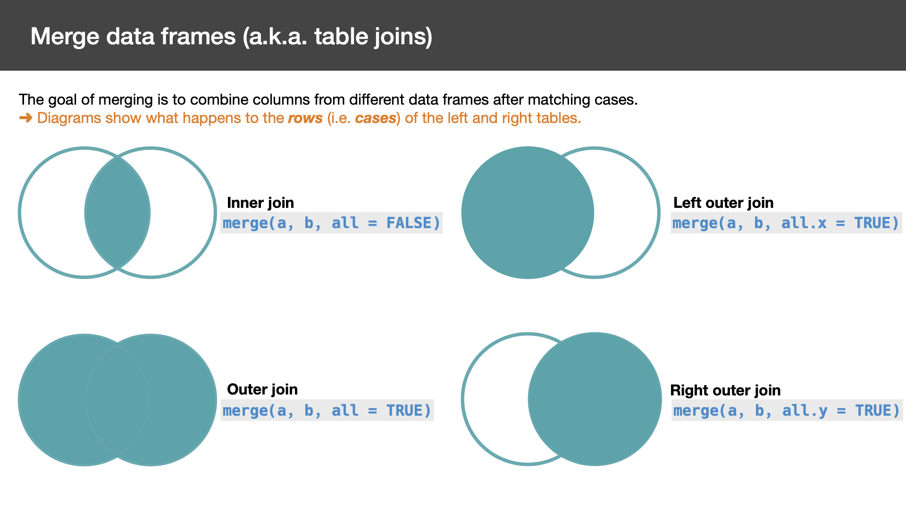

# Working with data frames {#dataframes}

```{r echo = FALSE}
knitr::opts_chunk$set(fig.width = 10, fig.height = 5,
                      comment = NA, cache = TRUE) 
options(rt.theme = "lightgrid")
options(rt.fit.theme = "lightgrid")
```

```{r, comment="", results="asis", echo=FALSE}
old.hooks <- fansi::set_knit_hooks(knitr::knit_hooks)
options(crayon.enabled = TRUE)
```

## Wide to Long

```{r wideLong, echo = FALSE, out.width = "100%", fig.align = "center", fig.cap = "Wide to Long"}
knitr::include_graphics("wideLong.png", dpi = NA)
```

```{r}
library(tidyr)
library(data.table)
```

Let's create some example data frame:
```{r}
(dat_wide <- data.frame(ID = c(1, 2, 3),
                       mango = c(1.1, 2.1, 3.1),
                       banana = c(1.2, 2.2, 3.2),
                       tangerine = c(1.3, 2.3, 3.3)))
```

### base
```{r}
(dat_wide2long <- reshape(data = dat_wide,                    # Data in wide format
                          idvar = "ID",                       # The column name that define case ID
                          varying = list(2:4),                # The columns whose values we want to keep
                          v.names = "Score",                  # The name of the new column which will contain all the values from the columns above
                          times = c(colnames(dat_wide)[2:4]), # The values/names, of length = (N of columns defined in "varying"), that will be recycled to indicate which column from the wide dataset each row corresponds to
                          timevar = "Fruit",                  # The name of the new column created to hold the values defined by "times"
                          direction = "long"))  
```

You Can also define 'varying' with character vector:  
`varying = list(c("mango", "banana","tangerine")`  

Explore the resulting data frame's attributes:
```{r}
attributes(dat_wide2long)
```

These added attributes reshaping back to wide as easy as:
```{r}
reshape(dat_wide2long)
```

Look at the following figure to understand `reshape`'s syntax:

```{r wideLongSyntax, echo = FALSE, out.width = "100%", fig.align = "center", fig.cap = "reshape syntax for Wide to Long"}
knitr::include_graphics("reshape_wide2long.png", dpi = NA)
```

### tidyr
```{r}
(dat_wide2long_tv <- pivot_longer(dat_wide,
                           cols = 2:4,
                           names_to = "Fruit",
                           values_to = "Score"))
```

### data.table
```{r}
dat_wide_dt <- as.data.table(dat_wide)
(dat_wide2long_dt <- melt(dat_wide_dt,
                          id.vars = 1,
                          measure.vars = 2:4,
                          variable.name = "Fruit",
                          value.name = "Score"))
setorder(dat_wide2long_dt, "ID")
```

## Long to Wide

Let's create our long dataset:
```{r}
(dat_long <- data.frame(ID = c(1, 2, 3, 1, 2, 3, 1, 2, 3),
                       Fruit = c("mango", "mango", "mango", 
                                 "banana", "banana", "banana", 
                                 "tangerine", "tangerine", "tangerine"),
                       Score = c(1.1, 2.1, 3.1, 1.2, 2.2, 3.2, 1.3, 2.3, 3.3)))
```

### base
```{r}
(dat_long2wide <- reshape(dat_long,
                          idvar = "ID",
                          timevar = "Fruit",
                          v.names = "Score",
                          direction = "wide"))
colnames(dat_long2wide) <- gsub("Score.", "", colnames(dat_long2wide))
dat_long2wide
```

### tidyr
```{r}
(dat_long2wide_tv <- pivot_wider(dat_long,
                                 id_cols = "ID",
                                 names_from = "Fruit",
                                 values_from = "Score"))
```

### data.table
`data.table`'s long to wide procedure is defined with a convenient formula notation:
```{r}
dat_long_dt <- as.data.table(dat_long)
dcast(dat_long_dt,
      ID ~ Fruit,
      value.var = "Score")
```

## Table Joins (i.e. Merging data.frames)
Scenario: You have received two or more tables with data. Each table consists of a unique identifier (ID), which is shared among the tables, plus a number of variables in columns, which may be unique to each table. You want to merge them into one big table so that for each ID you have all available information.  

Let's make up some data:
```{r}
(a <- data.frame(PID = c(1:9),
                Hospital = c("UCSF", "HUP", "Stanford",
                             "Stanford", "UCSF", "HUP", 
                             "HUP", "Stanford", "UCSF"),
                Age = c(22, 34, 41, 19, 53, 21, 63, 22, 19),
                Sex = c(1, 1, 0, 1, 0, 0, 1, 0, 0)))

(b  <- data.frame(PID = c(6:12),
                  V1 = c(153, 89, 112, 228,  91, 190, 101),
                  Department = c("Neurology", "Radiology",
                                 "Emergency", "Cardiology",
                                 "Surgery", "Neurology", "Psychiatry")))

dim(a)
dim(b)
```

There are four main types of join operations:
```{r, echo = FALSE, out.width = "100%",  fig.align = "center", fig.cap = "Common Join Operations"}

```


### Inner join
The default arguments of `merge` perform an inner join:
```{r}
(ab.inner <- merge(a, b))
(ab.inner <- merge(a, b, by = "PID"))
(ab.inner <- merge(a, b, all = FALSE))
```

Note that the resulting table only contains cases found in both data frames (IDs 6 through 9)

### Outer join
You can perform an outer join by specifying `all = TRUE`:
```{r}
(ab.outer <- merge(a, b, all = TRUE))
(ab.outer <- merge(a, b, by = "PID", all = TRUE))
```

Note that the resulting data frame contains all IDs found in either input data frame and missing values are represented with `NA`

### Left outer join
You can perform a left outer join by specifying `all.x = TRUE`:
```{r}
(ab.leftOuter <- merge(a, b, all.x = TRUE))
```
Note how the resulting data frame contains all IDs present in the left input data frame only. 

### Right outer join
You can perform a right outer join by specifying `all.y = TRUE`:
```{r}
(ab.rightOuter <- merge(a, b, all.y = TRUE))
```
Note how the resulting data frame contains all IDs present in the right input data frame only.

## Feature transformation with `transform`

Make up some data:
```{r}
dat <- data.frame(Sex = c(0, 0, 1, 1, 0),
                  Height = c(1.5, 1.6, 1.55, 1.73, 1.8),
                  Weight = c(55, 70, 69, 76, 91))
```

```{r}
(dat <- transform(dat, BMI = Weight/Height^2))
```

`transform` is not used too often, because it is trivial to do the same with direct assignment:
```{r}
dat$BMI <- dat$Weight/dat$Height^2
```
but can be useful when adding multiple variables and/or used in a pipe:
```{r}
library(magrittr)
(dat %>% 
  subset(Sex == 0) %>%
  transform(DeltaWeightFromMean = Weight - mean(Weight),
            BMI = Weight/Height^2,
            CI = Weight/Height^3))
```
