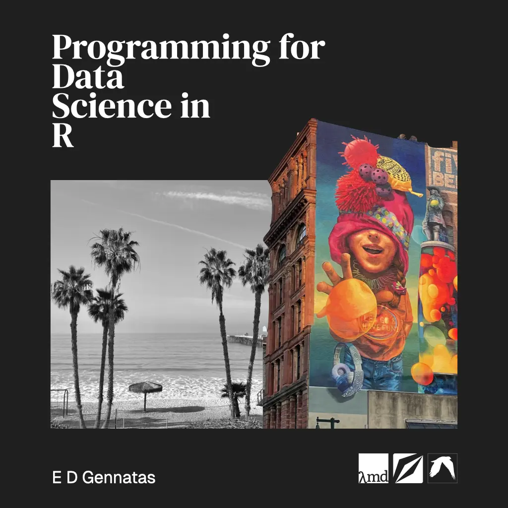

# 

 
PDSR is aimed as an introductory- to intermediate-level R programming learning resource.  
It is the online companion to the in-person UCSF Biostat 213 & 214 courses, Programming for Health Data Science I & II.
  
E.D. Gennatas

[Laboratory of Computational Medicine](https://www.lambdamd.org/),
[UCSF](https://www.ucsf.edu/)
