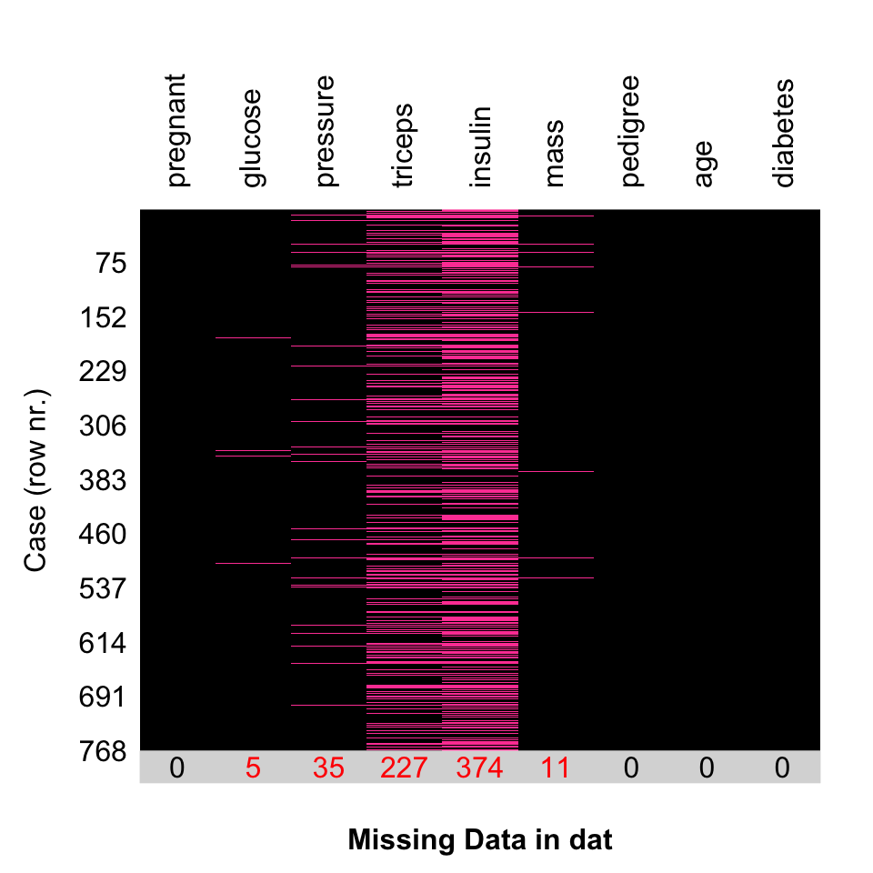

# Handling Missing data {#missingdata}


<STYLE type='text/css' scoped>
PRE.fansi SPAN {padding-top: .25em; padding-bottom: .25em};
</STYLE>


```r
library(rtemis)
```

```
  .:rtemis 0.8.1: Welcome, egenn
  [x86_64-apple-darwin17.0 (64-bit): Defaulting to 4/4 available cores]
  Documentation & vignettes: https://rtemis.lambdamd.org
```

Missing data is a very common issue in statistics and data science.

Data may be missing for a variety of reasons. We often characterize the type of missingness using the following three types[@mack2018managing]:  

* **Missing completely at random (MCAR)**:
“The fact that the data are missing is independent of the observed and unobserved data”
* **Missing at random (MAR)**:
"The fact that the data are missing is systematically related to the observed but not the unobserved data”
* **Missing not at random (MNAR)**:
“The fact that the data are missing is systematically related to the unobserved data”

## Check for missing data

You can use your favorite base commands to check for missing data, by row, by column, total, etc.

Let's load the `PimaIndiansDiabetes2` dataset from package **mlbench** and make a copy of it to variable `dat`. Remember to check the class of a new object you didn't create yourself with `class()`, check its dimensions, if applicable, with `dim()`, and a get a summary of its structure including data types with `str()`:


```r
data("PimaIndiansDiabetes2", package = "mlbench")
dat <- PimaIndiansDiabetes2
class(dat)
```

```
[1] "data.frame"
```

```r
dim(dat)
```

```
[1] 768   9
```

```r
str(dat)
```

```
'data.frame':	768 obs. of  9 variables:
 $ pregnant: num  6 1 8 1 0 5 3 10 2 8 ...
 $ glucose : num  148 85 183 89 137 116 78 115 197 125 ...
 $ pressure: num  72 66 64 66 40 74 50 NA 70 96 ...
 $ triceps : num  35 29 NA 23 35 NA 32 NA 45 NA ...
 $ insulin : num  NA NA NA 94 168 NA 88 NA 543 NA ...
 $ mass    : num  33.6 26.6 23.3 28.1 43.1 25.6 31 35.3 30.5 NA ...
 $ pedigree: num  0.627 0.351 0.672 0.167 2.288 ...
 $ age     : num  50 31 32 21 33 30 26 29 53 54 ...
 $ diabetes: Factor w/ 2 levels "neg","pos": 2 1 2 1 2 1 2 1 2 2 ...
```

Check if there are any missing values anywhere in the data.frame with `anyNA()`:


```r
anyNA(dat)
```

```
[1] TRUE
```

The above suggests there is at least one `NA` value in the dataset.

We can create a logical index of NA values using `is.na()`. This will be the same dimensions as the dataset. We print its first few lines with `head()`:


```r
na_index <- is.na(dat)
dim(na_index)
```

```
[1] 768   9
```

```r
head(na_index)
```

```
  pregnant glucose pressure triceps insulin  mass pedigree   age diabetes
1    FALSE   FALSE    FALSE   FALSE    TRUE FALSE    FALSE FALSE    FALSE
2    FALSE   FALSE    FALSE   FALSE    TRUE FALSE    FALSE FALSE    FALSE
3    FALSE   FALSE    FALSE    TRUE    TRUE FALSE    FALSE FALSE    FALSE
4    FALSE   FALSE    FALSE   FALSE   FALSE FALSE    FALSE FALSE    FALSE
5    FALSE   FALSE    FALSE   FALSE   FALSE FALSE    FALSE FALSE    FALSE
6    FALSE   FALSE    FALSE    TRUE    TRUE FALSE    FALSE FALSE    FALSE
```

One way to count missing values is with `sum(is.na())`. Remember that a logical array is coerced to an integer array for mathematical operations, where `TRUE` becomes 1 and `FALSE` becomes 0. Therefore, calling `sum()` on a logical index counts the number of `TRUE` elements (and since we are applying it on the index of `NA` values, it counts the number of elements with missing values):


```r
sum(is.na(dat))
```

```
[1] 652
```
There are 652 `NA` values in total in the data.frame.

Let's count the number of missing values per feature (i.e. column) using `sapply()`:


```r
sapply(dat, function(i) sum(is.na(i)))
```

```
pregnant  glucose pressure  triceps  insulin     mass pedigree      age 
       0        5       35      227      374       11        0        0 
diabetes 
       0 
```
The features `insulin` and `triceps` have the most NA values.

Let's count the number of missing values per case (i.e. row):


```r
sapply(1:nrow(dat), function(i) sum(is.na(dat[i, ])))
```

```
  [1] 1 1 2 0 0 2 0 3 0 3 2 2 2 0 0 3 0 2 0 0 0 2 2 1 0 0 2 0 0 2 1 0 0 2 1 0 2
 [38] 1 1 0 0 2 1 0 2 1 2 1 1 4 0 0 0 0 0 1 0 0 2 0 4 2 2 0 2 1 1 2 0 0 0 0 2 0
 [75] 1 2 2 1 3 1 1 4 0 1 2 0 1 0 0 1 2 0 0 2 0 0 1 0 0 0 2 2 2 0 2 0 2 0 0 0 0
[112] 0 0 2 0 2 2 2 1 0 0 1 0 2 2 0 0 0 0 2 0 2 0 1 0 0 0 0 2 0 2 1 0 2 0 2 1 0
[149] 2 1 0 2 0 0 2 1 0 0 0 0 1 0 0 1 2 0 1 2 2 0 2 0 2 0 0 0 2 0 2 2 2 0 1 2 2
[186] 1 0 0 0 0 2 0 2 3 1 0 2 0 0 0 1 2 1 0 0 1 0 2 0 1 1 1 1 0 0 0 0 0 1 2 0 2
[223] 3 0 0 0 2 1 0 0 2 0 0 2 0 2 0 1 1 2 1 0 2 0 0 1 2 0 0 1 2 2 0 1 0 1 1 1 0
[260] 0 0 3 1 1 2 0 3 1 2 3 1 0 2 0 2 0 1 0 2 0 2 0 0 2 2 0 0 0 0 0 0 0 0 0 2 0
[297] 0 0 0 2 3 0 0 2 2 0 0 0 0 0 1 0 0 0 1 0 0 2 0 2 0 1 1 0 1 0 0 2 0 0 1 0 3
[334] 2 0 0 3 2 0 2 0 0 2 2 2 0 0 3 0 2 2 2 1 0 2 2 0 2 0 0 0 2 1 2 0 0 2 1 0 0
[371] 0 1 0 0 0 0 0 0 2 0 0 1 0 0 0 0 1 1 0 0 0 2 0 0 2 0 0 1 2 1 2 2 0 1 2 0 2
[408] 2 2 0 1 0 0 0 0 0 1 1 2 0 0 0 0 1 0 0 4 0 0 0 3 0 0 2 1 3 1 2 1 2 1 0 0 2
[445] 1 0 0 0 0 0 0 2 0 3 0 1 2 0 0 0 0 2 0 1 2 0 0 0 3 0 1 1 1 2 2 1 0 0 0 1 0
[482] 1 0 0 3 0 0 0 1 2 0 1 1 0 4 2 2 0 0 0 0 1 2 0 1 2 0 0 0 2 1 0 2 2 0 0 0 2
[519] 2 0 0 0 4 2 2 1 0 0 0 2 0 2 0 3 0 3 2 2 0 0 0 0 1 0 0 0 0 0 0 1 1 0 2 0 0
[556] 0 1 2 1 2 2 0 0 0 2 0 0 0 0 0 2 2 0 0 0 0 0 2 2 1 1 1 1 2 0 1 2 2 0 3 1 0
[593] 2 0 0 0 2 0 2 0 1 3 1 0 3 1 0 0 0 0 0 0 0 1 0 2 2 0 1 3 0 1 2 0 2 0 2 2 2
[630] 1 2 0 2 0 2 2 2 0 0 0 0 2 2 3 0 0 0 0 0 1 0 0 0 2 0 0 0 0 2 0 2 1 0 0 1 0
[667] 1 1 0 0 0 1 0 0 2 2 2 2 2 0 0 1 0 2 3 0 2 1 0 0 2 2 0 0 2 0 0 3 0 2 0 1 1
[704] 3 0 1 4 0 2 0 0 0 1 0 2 0 0 1 0 1 1 0 0 0 2 1 0 1 2 2 0 2 0 0 2 1 0 1 0 2
[741] 0 0 0 2 0 0 1 0 0 2 2 0 1 0 1 0 1 2 2 2 0 1 2 0 1 0 2 1
```

If we wanted to get the row with the most missing values, we can use `which.max()`:


```r
which.max(sapply(1:nrow(dat), function(i) sum(is.na(dat[i, ]))))
```

```
[1] 50
```

```r
sum(is.na(dat[50, ]))
```

```
[1] 4
```
Row 50 has 4 missing values.

### Visualize

It may be helpful to visualize missing data to get a quick impression of missingness. With **rtemis**, you can use `mplot.missing()`. 


```r
library(rtemis)
mplot.missing(dat)
```



Missing data is shown in magenta by default. The row below the image shows total `NA` values per column

### Summarize

Get N of missing per column:


```r
sapply(dat, function(i) sum(is.na(i)))
```

```
pregnant  glucose pressure  triceps  insulin     mass pedigree      age 
       0        5       35      227      374       11        0        0 
diabetes 
       0 
```

`rtemis::checkData()` includes information on missing data:


```r
checkData(dat)
```

<PRE class="fansi fansi-output"><CODE>  Dataset: <span style='color: #00BBBB;font-weight: bold;'>dat</span><span> 

  </span><span style='color: #555555;font-weight: bold;'>[[ </span><span style='font-weight: bold;'>Summary</span><span style='color: #555555;font-weight: bold;'> ]]
</span><span>  </span><span style='font-weight: bold;'>768</span><span> cases with </span><span style='font-weight: bold;'>9</span><span> features: 
  * </span><span style='font-weight: bold;'>8</span><span> continuous features 
  * </span><span style='font-weight: bold;'>0</span><span> integer features 
  * </span><span style='font-weight: bold;'>1</span><span> categorical feature, which is not ordered
  * </span><span style='font-weight: bold;'>0</span><span> constant features 
  * </span><span style='font-weight: bold;'>0</span><span> duplicated cases 
  * </span><span style='color: #BBBB00;font-weight: bold;'>5</span><span> features include 'NA' values; </span><span style='color: #BBBB00;font-weight: bold;'>652</span><span> 'NA' values total
    ** Max percent missing in a feature is </span><span style='color: #BBBB00;font-weight: bold;'>48.70%</span><span> (</span><span style='font-weight: bold;'>insulin</span><span>)
    ** Max percent missing in a case is </span><span style='color: #BBBB00;font-weight: bold;'>44.44%</span><span> (case #</span><span style='font-weight: bold;'>50</span><span>)

  </span><span style='color: #555555;font-weight: bold;'>[[ </span><span style='font-weight: bold;'>Recommendations</span><span style='color: #555555;font-weight: bold;'> ]]
</span><span style='color: #BBBB00;font-weight: bold;'>  * Consider imputing missing values or use complete cases only
</span><span>
</span></CODE></PRE>

## Handle missing data

Different approaches can be used to handle missing data:  

* Do nothing! - if your algorithm(s) can handle missing data (decision trees!)
* **Exclude** data: Use complete cases only
* **Fill in** (make up) data: Replace or Impute
    * Replace with median/mean
    * Predict missing from present
        * Single imputation
        * Multiple imputation
        
### Do nothing

Algorithms like decision trees and ensemble methods that use decision trees like random forest and gradient boosting can handle missing data, depending on the particular implementation. For example, `rpart::rpart()` which is used by `rtemis::s.CART()` has no trouble with missing data in the predictors:


```r
dat.cart <- s.CART(dat)
```

<PRE class="fansi fansi-output"><CODE><span style='color: #555555;'>[2020-11-09 01:06:30</span><span style='color: #555555;font-weight: bold;'> s.CART</span><span style='color: #555555;'>] Hello,</span><span> </span><span style='color: #555555;'>egenn</span><span> 

</span><span style='color: #555555;'>[2020-11-09 01:06:30</span><span style='color: #555555;font-weight: bold;'> dataPrepare</span><span style='color: #555555;'>] </span><span>Imbalanced classes: using Inverse Probability Weighting 

</span><span style='color: #555555;font-weight: bold;'>[[ </span><span style='font-weight: bold;'>Classification Input Summary</span><span style='color: #555555;font-weight: bold;'> ]]
</span><span>   Training features: </span><span style='font-weight: bold;'>768 x 8 
</span><span>    Training outcome: </span><span style='font-weight: bold;'>768 x 1 
</span><span>    Testing features: Not available
     Testing outcome: Not available

</span><span style='color: #555555;'>[2020-11-09 01:06:32</span><span style='color: #555555;font-weight: bold;'> s.CART</span><span style='color: #555555;'>] </span><span>Training CART... 

</span><span style='color: #555555;font-weight: bold;'>[[ </span><span style='font-weight: bold;'>CART Classification Training Summary</span><span style='color: #555555;font-weight: bold;'> ]]
</span><span style='font-weight: bold;'>                   Reference</span><span> 
</span><span style='font-weight: bold;'>        Estimated</span><span>  </span><span style='color: #00BBBB;font-weight: bold;'>neg  pos  </span><span>
</span><span style='color: #00BBBB;font-weight: bold;'>              neg</span><span>  426   89
</span><span style='color: #00BBBB;font-weight: bold;'>              pos</span><span>   74  179

                   </span><span style='color: #00BBBB;font-weight: bold;'>Overall  </span><span>
      Sensitivity  0.8520 
      Specificity  0.6679 
Balanced Accuracy  0.7600 
              PPV  0.8272 
              NPV  0.7075 
               F1  0.8394 
         Accuracy  0.7878 
              AUC  0.7854 

  Positive Class:  </span><span style='color: #00BBBB;font-weight: bold;'>neg</span><span> 
</span></CODE></PRE><PRE class="fansi fansi-output"><CODE>
<span style='color: #555555;'>[2020-11-09 01:06:32</span><span style='color: #555555;font-weight: bold;'> s.CART</span><span style='color: #555555;'>] Run completed in 0.04 minutes (Real: 2.15; User: 1.28; System: 0.11)</span><span> 
</span></CODE></PRE>

### Use complete cases only

R's builtin `complete.cases()` function returns, as the name suggests, a logical index of cases (i.e. rows) that have no missing values, i.e. are complete.


```r
dim(dat)
```

```
[1] 768   9
```

```r
index_cc <- complete.cases(dat)
class(index_cc)
```

```
[1] "logical"
```

```r
length(index_cc)
```

```
[1] 768
```

```r
head(index_cc)
```

```
[1] FALSE FALSE FALSE  TRUE  TRUE FALSE
```

```r
dat_cc <- dat[index_cc, ]
dim(dat_cc)
```

```
[1] 392   9
```

We lost 376 cases in the above example. That's quite a few, so, for this dataset, we probably want to look at options that do not exclude cases.

### Replace with a fixed value

We can manually replace missing values with the mean or median in the case of a continuous variable, or with the mode in the case of a categorical feature.  
For example, to replace the first feature's missing values with the mean:


```r
pressure_mean <- mean(dat$pressure, na.rm = TRUE)
dat_im <- dat
dat_im$pressure[is.na(dat_im$pressure)] <- pressure_mean
```

`rtemis::preprocess()` can replace missing values with mean (for numeric features) and the mode (for factors) for all columns:


```r
dat_pre <- preprocess(dat, impute = TRUE, impute.type = "meanMode")
```

<PRE class="fansi fansi-output"><CODE><span style='color: #555555;'>[2020-11-09 01:06:33</span><span style='color: #555555;font-weight: bold;'> preprocess</span><span style='color: #555555;'>] </span><span>Imputing missing values using mean and getMode... 
</span><span style='color: #555555;'>[2020-11-09 01:06:33</span><span style='color: #555555;font-weight: bold;'> preprocess</span><span style='color: #555555;'>] </span><span>Done 
</span></CODE></PRE>

Verify there are no missing data by rerunning `checkData()`:


```r
checkData(dat_pre)
```

<PRE class="fansi fansi-output"><CODE>  Dataset: <span style='color: #00BBBB;font-weight: bold;'>dat_pre</span><span> 

  </span><span style='color: #555555;font-weight: bold;'>[[ </span><span style='font-weight: bold;'>Summary</span><span style='color: #555555;font-weight: bold;'> ]]
</span><span>  </span><span style='font-weight: bold;'>768</span><span> cases with </span><span style='font-weight: bold;'>9</span><span> features: 
  * </span><span style='font-weight: bold;'>8</span><span> continuous features 
  * </span><span style='font-weight: bold;'>0</span><span> integer features 
  * </span><span style='font-weight: bold;'>1</span><span> categorical feature, which is not ordered
  * </span><span style='font-weight: bold;'>0</span><span> constant features 
  * </span><span style='font-weight: bold;'>0</span><span> duplicated cases 
  * </span><span style='font-weight: bold;'>0</span><span> features include 'NA' values

  </span><span style='color: #555555;font-weight: bold;'>[[ </span><span style='font-weight: bold;'>Recommendations</span><span style='color: #555555;font-weight: bold;'> ]]
</span><span style='color: #00BB00;font-weight: bold;'>  * Everything looks good
</span><span>
</span></CODE></PRE>

You may want to include a "missingness" column that indicates which cases were imputed to include in your model. You can create this simply by running:


```r
pressure_missing = factor(as.integer(is.na(dat$pressure)))
```

`preprocess()` includes the option `missingness` to add corresponding indicator columns after imputation:


```r
dat_pre <- preprocess(dat, impute = TRUE, impute.type = "meanMode",
                      missingness = TRUE)
```

<PRE class="fansi fansi-output"><CODE><span style='color: #555555;'>[2020-11-09 01:06:33</span><span style='color: #555555;font-weight: bold;'> preprocess</span><span style='color: #555555;'>] </span><span>Created missingness indicator for glucose 
</span><span style='color: #555555;'>[2020-11-09 01:06:33</span><span style='color: #555555;font-weight: bold;'> preprocess</span><span style='color: #555555;'>] </span><span>Created missingness indicator for pressure 
</span><span style='color: #555555;'>[2020-11-09 01:06:33</span><span style='color: #555555;font-weight: bold;'> preprocess</span><span style='color: #555555;'>] </span><span>Created missingness indicator for triceps 
</span><span style='color: #555555;'>[2020-11-09 01:06:33</span><span style='color: #555555;font-weight: bold;'> preprocess</span><span style='color: #555555;'>] </span><span>Created missingness indicator for insulin 
</span><span style='color: #555555;'>[2020-11-09 01:06:33</span><span style='color: #555555;font-weight: bold;'> preprocess</span><span style='color: #555555;'>] </span><span>Created missingness indicator for mass 
</span><span style='color: #555555;'>[2020-11-09 01:06:33</span><span style='color: #555555;font-weight: bold;'> preprocess</span><span style='color: #555555;'>] </span><span>Imputing missing values using mean and getMode... 
</span><span style='color: #555555;'>[2020-11-09 01:06:33</span><span style='color: #555555;font-weight: bold;'> preprocess</span><span style='color: #555555;'>] </span><span>Done 
</span></CODE></PRE>

```r
head(dat_pre)
```

```
  pregnant glucose pressure  triceps  insulin mass pedigree age diabetes
1        6     148       72 35.00000 155.5482 33.6    0.627  50      pos
2        1      85       66 29.00000 155.5482 26.6    0.351  31      neg
3        8     183       64 29.15342 155.5482 23.3    0.672  32      pos
4        1      89       66 23.00000  94.0000 28.1    0.167  21      neg
5        0     137       40 35.00000 168.0000 43.1    2.288  33      pos
6        5     116       74 29.15342 155.5482 25.6    0.201  30      neg
  glucose_missing pressure_missing triceps_missing insulin_missing mass_missing
1               0                0               0               1            0
2               0                0               0               1            0
3               0                0               1               1            0
4               0                0               0               0            0
5               0                0               0               0            0
6               0                0               1               1            0
```

#### Add new level "missing"

One option to handle missing data in categorical variables, is to introduce a new level of "missing" to the factor, instead of replacing with the mode, for example. If we bin a continuous variable to convert to categorical, the same can then also be applied.  

Since no factors have missing values in the current dataset we create a copy and replace some data with `NA`:


```r
dat2 <- dat
dat2$diabetes[sample(1:NROW(dat2), 35)] <- NA
sum(is.na(dat2$diabetes))
```

```
[1] 35
```

```r
levels(dat2$diabetes)
```

```
[1] "neg" "pos"
```

Replace `NA` values with new level `missing`:


```r
dat_pre2 <- preprocess(dat2, factorNA2missing = TRUE)
```

<PRE class="fansi fansi-output"><CODE><span style='color: #555555;'>[2020-11-09 01:06:33</span><span style='color: #555555;font-weight: bold;'> preprocess</span><span style='color: #555555;'>] </span><span>Converting NA in factors to level "missing"... 
</span><span style='color: #555555;'>[2020-11-09 01:06:33</span><span style='color: #555555;font-weight: bold;'> preprocess</span><span style='color: #555555;'>] </span><span>Done 
</span></CODE></PRE>

```r
anyNA(dat_pre2$diabetes)
```

```
[1] FALSE
```

```r
levels(dat_pre2$diabetes)
```

```
[1] "neg"     "pos"     "missing"
```

### Last observation carried forward (LOCF)

In longitudinal / timeseries data, we may want to replace missing values with the last observed value. This is called last observation carried forward (LOCF). As always, whether this procedure is appropriate depend the reasons for missingness. The `zoo` and `DescTool` packages provide commands to perform LOCF.  

Some simulated data. We are missing blood pressure measurements on Saturdays and Sundays:


```r
dat <- data.frame(Day = rep(c("Mon", "Tues", "Wed", "Thu", "Fri", "Sat", "Sun"), 3),
                  SBP = sample(105:125, 21, TRUE))
dat$SBP[dat$Day == "Sat" | dat$Day == "Sun"] <- NA
dat
```

```
    Day SBP
1   Mon 115
2  Tues 116
3   Wed 111
4   Thu 112
5   Fri 119
6   Sat  NA
7   Sun  NA
8   Mon 106
9  Tues 113
10  Wed 109
11  Thu 112
12  Fri 108
13  Sat  NA
14  Sun  NA
15  Mon 111
16 Tues 109
17  Wed 108
18  Thu 120
19  Fri 107
20  Sat  NA
21  Sun  NA
```

The **zoo** package includes the `na.locf()`. 


```r
dat$SBPlocf <- zoo::na.locf(dat$SBP)
dat
```

```
    Day SBP SBPlocf
1   Mon 115     115
2  Tues 116     116
3   Wed 111     111
4   Thu 112     112
5   Fri 119     119
6   Sat  NA     119
7   Sun  NA     119
8   Mon 106     106
9  Tues 113     113
10  Wed 109     109
11  Thu 112     112
12  Fri 108     108
13  Sat  NA     108
14  Sun  NA     108
15  Mon 111     111
16 Tues 109     109
17  Wed 108     108
18  Thu 120     120
19  Fri 107     107
20  Sat  NA     107
21  Sun  NA     107
```

Similar functionality is included in **DescTools**' `LOCF()` function:


```r
DescTools::LOCF(dat$SBP)
```

```
 [1] 115 116 111 112 119 119 119 106 113 109 112 108 108 108 111 109 108 120 107
[20] 107 107
```

### Replace missing values with estimated values

#### Single imputation

You can use non-missing data to predict missing data in an iterative procedure [@buuren2010mice][@stekhoven2012missforest].
The `missRanger` package uses the optimized (and parallel-capable) package `ranger` [@wright2015ranger] to iteratively train random forest models for imputation.


```r
library(missRanger)
dat <- iris
set.seed(2020)
dat[sample(1:150, 5), 1] <- dat[sample(1:150, 22), 4] <- dat[sample(1:150, 18), 4] <- NA
dat_rfimp <- missRanger(dat, num.trees = 100)
```

```

Missing value imputation by random forests

  Variables to impute:		Sepal.Length, Petal.Width
  Variables used to impute:	Sepal.Length, Sepal.Width, Petal.Length, Petal.Width, Species
iter 1:	..
iter 2:	..
iter 3:	..
iter 4:	..
```

```r
head(dat_rfimp)
```

```
  Sepal.Length Sepal.Width Petal.Length Petal.Width Species
1     5.100000         3.5          1.4         0.2  setosa
2     4.900000         3.0          1.4         0.2  setosa
3     4.732533         3.2          1.3         0.2  setosa
4     4.600000         3.1          1.5         0.2  setosa
5     5.000000         3.6          1.4         0.2  setosa
6     5.400000         3.9          1.7         0.4  setosa
```

```r
checkData(dat_rfimp)
```

<PRE class="fansi fansi-output"><CODE>  Dataset: <span style='color: #00BBBB;font-weight: bold;'>dat_rfimp</span><span> 

  </span><span style='color: #555555;font-weight: bold;'>[[ </span><span style='font-weight: bold;'>Summary</span><span style='color: #555555;font-weight: bold;'> ]]
</span><span>  </span><span style='font-weight: bold;'>150</span><span> cases with </span><span style='font-weight: bold;'>5</span><span> features: 
  * </span><span style='font-weight: bold;'>4</span><span> continuous features 
  * </span><span style='font-weight: bold;'>0</span><span> integer features 
  * </span><span style='font-weight: bold;'>1</span><span> categorical feature, which is not ordered
    ** </span><span style='font-weight: bold;'>1</span><span> unordered categorical feature has more than 2 levels
  * </span><span style='font-weight: bold;'>0</span><span> constant features 
  * </span><span style='color: #BB0000;font-weight: bold;'>1</span><span> duplicated case 
  * </span><span style='font-weight: bold;'>0</span><span> features include 'NA' values

  </span><span style='color: #555555;font-weight: bold;'>[[ </span><span style='font-weight: bold;'>Recommendations</span><span style='color: #555555;font-weight: bold;'> ]]
</span><span style='color: #BBBB00;font-weight: bold;'>  * Remove the duplicated case 
</span><span style='color: #00BBBB;font-weight: bold;'>  * Check the unordered categorical feature with more than 2 levels and consider
    if ordering would make sense
</span><span>
</span></CODE></PRE>

Note: The default method for `preprocess(impute = TRUE)` is to use `missRanger`.

#### Multiple imputation

Multiple imputation creates multiple estimates of the missing data. It is more statistically valid for small datasets, especially when the goal is to get accurate estimates of a summary statistics, but may not be practical for larger datasets. It is not usually considered an option for machine learning (where duplicating cases may add bias and complexity in resampling). The package `mice` is a popular choice for multiple imputation in R.


```r
library(mice)
dat_mice <- mice(dat)
```
