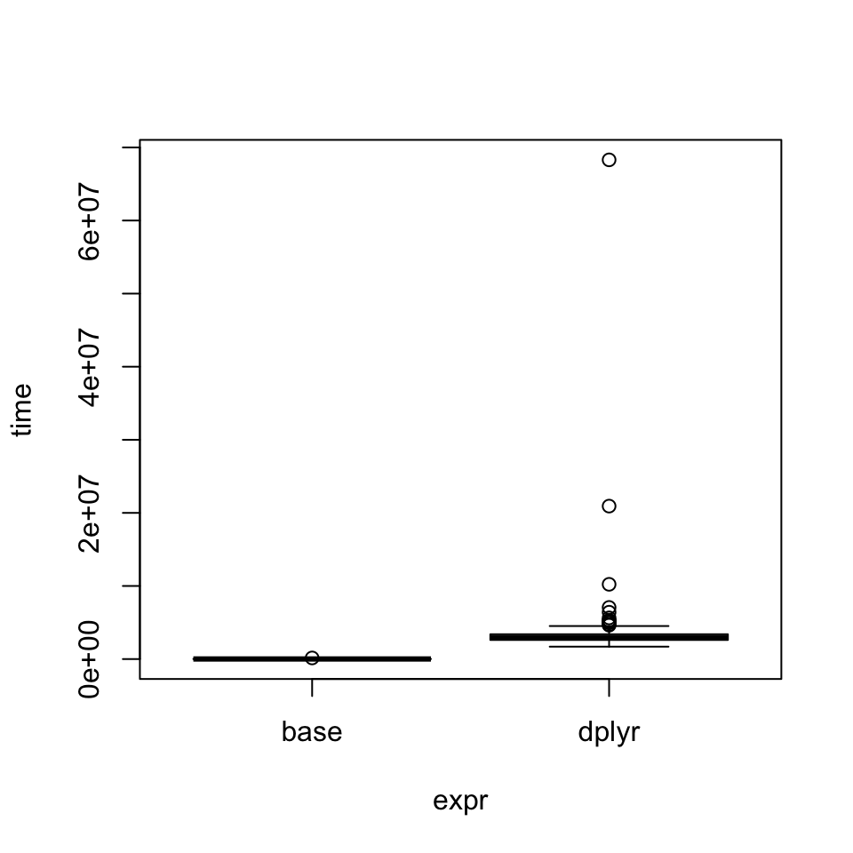
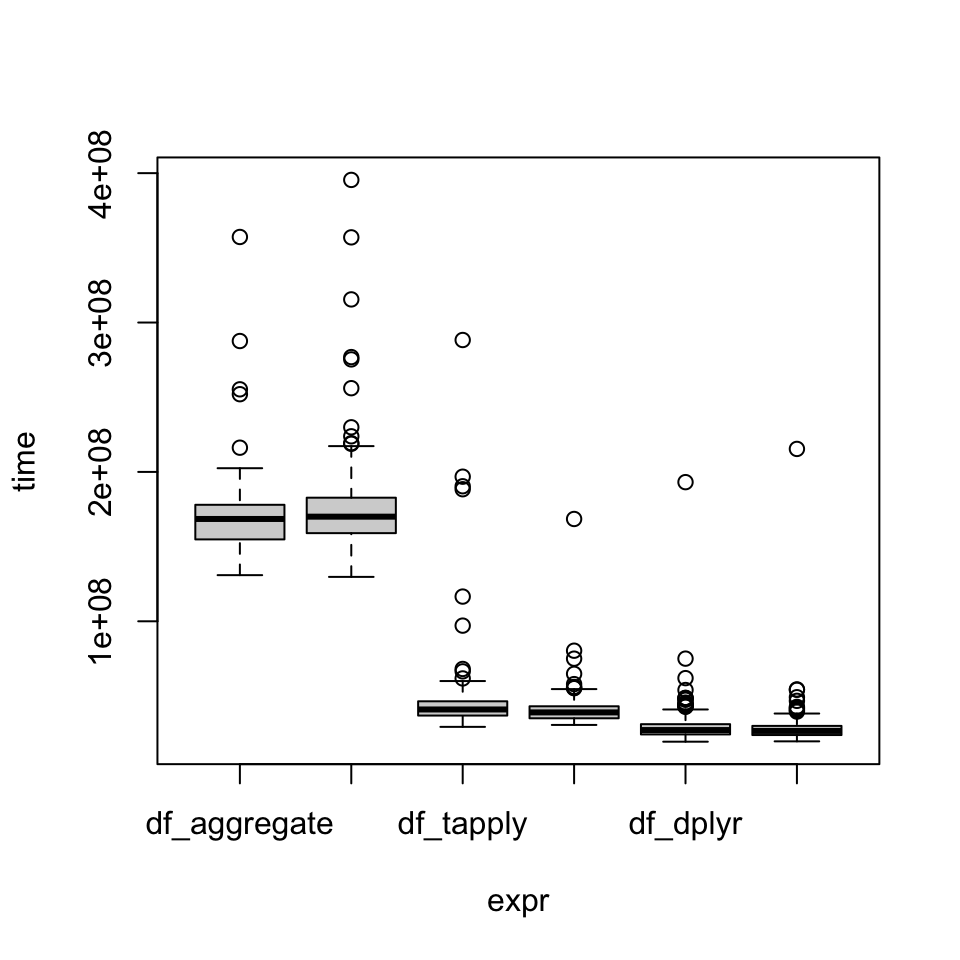

# Timing & Profiling {#profiling}


<STYLE type='text/css' scoped>
PRE.fansi SPAN {padding-top: .25em; padding-bottom: .25em};
</STYLE>

Profiling your code involves timing the execution of different steps of a program. This is usually performed in order to identify bottlenecks that slow down the execution of your code and it helps you prioritize which parts to optimize. A 

## Time the execution of an expression with `system.time`

If you want to time how long it takes for an R expression to complete, you can use the base command `system.time`.  
"elapsed" time is real time in seconds. "user" and "system" are time used by the CPU on different types of tasks (see `?proc.time`)


```r
x <- rnorm(9999)
system.time({
    y <- vector("numeric", 9999)
    for (i in 1:9999) y[i] <- x[i]^3
})
```

```
   user  system elapsed 
  0.009   0.000   0.014 
```


```r
system.time(x^3)
```

```
   user  system elapsed 
  0.001   0.000   0.001 
```

You can use `replicate()` to get a measure of time over multiple executions and average it:


```r
library(mgcv)
```

```
Loading required package: nlme
```

```
This is mgcv 1.8-33. For overview type 'help("mgcv-package")'.
```

```r
library(glmnet)
```

```
Loading required package: Matrix
```

```
Loaded glmnet 4.0-2
```

```r
set.seed(2020)
x <- replicate(100, rnorm(5000))
y <- x[, 1]^2 + x[, 5]^3 + 12 + rnorm(5000)
dat <- data.frame(x, y)
fit.glm <- function(dat) mod <- glm(y ~ x, family = gaussian, data = dat)
fit.gam <- function(dat) mod <- gam(y ~ x, family = gaussian, data = dat)
    
system.time(replicate(1000, fit.glm))
```

```
   user  system elapsed 
  0.003   0.000   0.005 
```

```r
system.time(replicate(1000, fit.gam))
```

```
   user  system elapsed 
  0.002   0.000   0.002 
```

## Compare execution times of different expressions with `microbenchmark()`

`microbenchmark()` allows you to time the execution of multiple expressions with sub-millisecond accuracy. It will execute each command a number of times as defined by the `times` argument (default = 100), and output statistics of execution time per expression in nanoseconds. Using `plot()` on the output produces a boxplot comparing the time distributions.


```r
library(microbenchmark)
```

To start, we compare two very simple and fast operations, using base and dplyr to add two columns of 1000 integers:


```r
dat <- as.data.frame(matrix(1:2000, 1000))
dim(dat)
```

```
[1] 1000    2
```

```r
library(dplyr)
```

```

Attaching package: 'dplyr'
```

```
The following object is masked from 'package:nlme':

    collapse
```

```
The following objects are masked from 'package:stats':

    filter, lag
```

```
The following objects are masked from 'package:base':

    intersect, setdiff, setequal, union
```


```r
add2k <- microbenchmark(
  base = dat$V1 + dat$V2,
  dplyr = mutate(dat, a = V1 + V2))
```

You can print microbenchmark's output:


```r
add2k
```

```
Unit: microseconds
  expr      min       lq       mean   median        uq       max neval
  base    5.338    8.771   12.89646   10.984   15.5935   151.785   100
 dplyr 1697.295 2611.060 4039.74906 2904.940 3395.5460 68299.232   100
```

and plot it:


```r
plot(add2k)
```



Now let's use the **nycflights13** dataset which includes data on 336776 flights that departed from any of the three NY area airports in 2013. Because the data comes as a [tibble](https://tibble.tidyverse.org/), we shall perform all operations on the tibble and a data.frame of the same data to compare.


```r
library(nycflights13)
class(flights)
```

```
[1] "tbl_df"     "tbl"        "data.frame"
```

```r
dim(flights)
```

```
[1] 336776     19
```

```r
flightsDF <- as.data.frame(flights)
```

Compare performance base R vs. dplyr in calculating mean arrival delay by carrier using either a data.frame or a tibble:


```r
dbc <- microbenchmark(
  df_aggregate = aggregate(flightsDF$arr_delay, by = list(flightsDF$carrier), mean, na.rm = TRUE),
  tb_aggregate = aggregate(flights$arr_delay, by = list(flights$carrier), mean, na.rm = TRUE),
  df_tapply = tapply(flightsDF$arr_delay, flightsDF$carrier, mean, na.rm = TRUE),
  tb_tapply = tapply(flights$arr_delay, flights$carrier, mean, na.rm = TRUE),
  df_dplyr = flightsDF %>% group_by(carrier) %>% summarize(mean(arr_delay, na.rm = TRUE)),
  tb_dplyr = flights %>% group_by(carrier) %>% summarize(mean(arr_delay, na.rm = TRUE)))
```

```
`summarise()` ungrouping output (override with `.groups` argument)
`summarise()` ungrouping output (override with `.groups` argument)
`summarise()` ungrouping output (override with `.groups` argument)
`summarise()` ungrouping output (override with `.groups` argument)
`summarise()` ungrouping output (override with `.groups` argument)
`summarise()` ungrouping output (override with `.groups` argument)
`summarise()` ungrouping output (override with `.groups` argument)
`summarise()` ungrouping output (override with `.groups` argument)
`summarise()` ungrouping output (override with `.groups` argument)
`summarise()` ungrouping output (override with `.groups` argument)
`summarise()` ungrouping output (override with `.groups` argument)
`summarise()` ungrouping output (override with `.groups` argument)
`summarise()` ungrouping output (override with `.groups` argument)
`summarise()` ungrouping output (override with `.groups` argument)
`summarise()` ungrouping output (override with `.groups` argument)
`summarise()` ungrouping output (override with `.groups` argument)
`summarise()` ungrouping output (override with `.groups` argument)
`summarise()` ungrouping output (override with `.groups` argument)
`summarise()` ungrouping output (override with `.groups` argument)
`summarise()` ungrouping output (override with `.groups` argument)
`summarise()` ungrouping output (override with `.groups` argument)
`summarise()` ungrouping output (override with `.groups` argument)
`summarise()` ungrouping output (override with `.groups` argument)
`summarise()` ungrouping output (override with `.groups` argument)
`summarise()` ungrouping output (override with `.groups` argument)
`summarise()` ungrouping output (override with `.groups` argument)
`summarise()` ungrouping output (override with `.groups` argument)
`summarise()` ungrouping output (override with `.groups` argument)
`summarise()` ungrouping output (override with `.groups` argument)
`summarise()` ungrouping output (override with `.groups` argument)
`summarise()` ungrouping output (override with `.groups` argument)
`summarise()` ungrouping output (override with `.groups` argument)
`summarise()` ungrouping output (override with `.groups` argument)
`summarise()` ungrouping output (override with `.groups` argument)
`summarise()` ungrouping output (override with `.groups` argument)
`summarise()` ungrouping output (override with `.groups` argument)
`summarise()` ungrouping output (override with `.groups` argument)
`summarise()` ungrouping output (override with `.groups` argument)
`summarise()` ungrouping output (override with `.groups` argument)
`summarise()` ungrouping output (override with `.groups` argument)
`summarise()` ungrouping output (override with `.groups` argument)
`summarise()` ungrouping output (override with `.groups` argument)
`summarise()` ungrouping output (override with `.groups` argument)
`summarise()` ungrouping output (override with `.groups` argument)
`summarise()` ungrouping output (override with `.groups` argument)
`summarise()` ungrouping output (override with `.groups` argument)
`summarise()` ungrouping output (override with `.groups` argument)
`summarise()` ungrouping output (override with `.groups` argument)
`summarise()` ungrouping output (override with `.groups` argument)
`summarise()` ungrouping output (override with `.groups` argument)
`summarise()` ungrouping output (override with `.groups` argument)
`summarise()` ungrouping output (override with `.groups` argument)
`summarise()` ungrouping output (override with `.groups` argument)
`summarise()` ungrouping output (override with `.groups` argument)
`summarise()` ungrouping output (override with `.groups` argument)
`summarise()` ungrouping output (override with `.groups` argument)
`summarise()` ungrouping output (override with `.groups` argument)
`summarise()` ungrouping output (override with `.groups` argument)
`summarise()` ungrouping output (override with `.groups` argument)
`summarise()` ungrouping output (override with `.groups` argument)
`summarise()` ungrouping output (override with `.groups` argument)
`summarise()` ungrouping output (override with `.groups` argument)
`summarise()` ungrouping output (override with `.groups` argument)
`summarise()` ungrouping output (override with `.groups` argument)
`summarise()` ungrouping output (override with `.groups` argument)
`summarise()` ungrouping output (override with `.groups` argument)
`summarise()` ungrouping output (override with `.groups` argument)
`summarise()` ungrouping output (override with `.groups` argument)
`summarise()` ungrouping output (override with `.groups` argument)
`summarise()` ungrouping output (override with `.groups` argument)
`summarise()` ungrouping output (override with `.groups` argument)
`summarise()` ungrouping output (override with `.groups` argument)
`summarise()` ungrouping output (override with `.groups` argument)
`summarise()` ungrouping output (override with `.groups` argument)
`summarise()` ungrouping output (override with `.groups` argument)
`summarise()` ungrouping output (override with `.groups` argument)
`summarise()` ungrouping output (override with `.groups` argument)
`summarise()` ungrouping output (override with `.groups` argument)
`summarise()` ungrouping output (override with `.groups` argument)
`summarise()` ungrouping output (override with `.groups` argument)
`summarise()` ungrouping output (override with `.groups` argument)
`summarise()` ungrouping output (override with `.groups` argument)
`summarise()` ungrouping output (override with `.groups` argument)
`summarise()` ungrouping output (override with `.groups` argument)
`summarise()` ungrouping output (override with `.groups` argument)
`summarise()` ungrouping output (override with `.groups` argument)
`summarise()` ungrouping output (override with `.groups` argument)
`summarise()` ungrouping output (override with `.groups` argument)
`summarise()` ungrouping output (override with `.groups` argument)
`summarise()` ungrouping output (override with `.groups` argument)
`summarise()` ungrouping output (override with `.groups` argument)
`summarise()` ungrouping output (override with `.groups` argument)
`summarise()` ungrouping output (override with `.groups` argument)
`summarise()` ungrouping output (override with `.groups` argument)
`summarise()` ungrouping output (override with `.groups` argument)
`summarise()` ungrouping output (override with `.groups` argument)
`summarise()` ungrouping output (override with `.groups` argument)
`summarise()` ungrouping output (override with `.groups` argument)
`summarise()` ungrouping output (override with `.groups` argument)
`summarise()` ungrouping output (override with `.groups` argument)
`summarise()` ungrouping output (override with `.groups` argument)
`summarise()` ungrouping output (override with `.groups` argument)
`summarise()` ungrouping output (override with `.groups` argument)
`summarise()` ungrouping output (override with `.groups` argument)
`summarise()` ungrouping output (override with `.groups` argument)
`summarise()` ungrouping output (override with `.groups` argument)
`summarise()` ungrouping output (override with `.groups` argument)
`summarise()` ungrouping output (override with `.groups` argument)
`summarise()` ungrouping output (override with `.groups` argument)
`summarise()` ungrouping output (override with `.groups` argument)
`summarise()` ungrouping output (override with `.groups` argument)
`summarise()` ungrouping output (override with `.groups` argument)
`summarise()` ungrouping output (override with `.groups` argument)
`summarise()` ungrouping output (override with `.groups` argument)
`summarise()` ungrouping output (override with `.groups` argument)
`summarise()` ungrouping output (override with `.groups` argument)
`summarise()` ungrouping output (override with `.groups` argument)
`summarise()` ungrouping output (override with `.groups` argument)
`summarise()` ungrouping output (override with `.groups` argument)
`summarise()` ungrouping output (override with `.groups` argument)
`summarise()` ungrouping output (override with `.groups` argument)
`summarise()` ungrouping output (override with `.groups` argument)
`summarise()` ungrouping output (override with `.groups` argument)
`summarise()` ungrouping output (override with `.groups` argument)
`summarise()` ungrouping output (override with `.groups` argument)
`summarise()` ungrouping output (override with `.groups` argument)
`summarise()` ungrouping output (override with `.groups` argument)
`summarise()` ungrouping output (override with `.groups` argument)
`summarise()` ungrouping output (override with `.groups` argument)
`summarise()` ungrouping output (override with `.groups` argument)
`summarise()` ungrouping output (override with `.groups` argument)
`summarise()` ungrouping output (override with `.groups` argument)
`summarise()` ungrouping output (override with `.groups` argument)
`summarise()` ungrouping output (override with `.groups` argument)
`summarise()` ungrouping output (override with `.groups` argument)
`summarise()` ungrouping output (override with `.groups` argument)
`summarise()` ungrouping output (override with `.groups` argument)
`summarise()` ungrouping output (override with `.groups` argument)
`summarise()` ungrouping output (override with `.groups` argument)
`summarise()` ungrouping output (override with `.groups` argument)
`summarise()` ungrouping output (override with `.groups` argument)
`summarise()` ungrouping output (override with `.groups` argument)
`summarise()` ungrouping output (override with `.groups` argument)
`summarise()` ungrouping output (override with `.groups` argument)
`summarise()` ungrouping output (override with `.groups` argument)
`summarise()` ungrouping output (override with `.groups` argument)
`summarise()` ungrouping output (override with `.groups` argument)
`summarise()` ungrouping output (override with `.groups` argument)
`summarise()` ungrouping output (override with `.groups` argument)
`summarise()` ungrouping output (override with `.groups` argument)
`summarise()` ungrouping output (override with `.groups` argument)
`summarise()` ungrouping output (override with `.groups` argument)
`summarise()` ungrouping output (override with `.groups` argument)
`summarise()` ungrouping output (override with `.groups` argument)
`summarise()` ungrouping output (override with `.groups` argument)
`summarise()` ungrouping output (override with `.groups` argument)
`summarise()` ungrouping output (override with `.groups` argument)
`summarise()` ungrouping output (override with `.groups` argument)
`summarise()` ungrouping output (override with `.groups` argument)
`summarise()` ungrouping output (override with `.groups` argument)
`summarise()` ungrouping output (override with `.groups` argument)
`summarise()` ungrouping output (override with `.groups` argument)
`summarise()` ungrouping output (override with `.groups` argument)
`summarise()` ungrouping output (override with `.groups` argument)
`summarise()` ungrouping output (override with `.groups` argument)
`summarise()` ungrouping output (override with `.groups` argument)
`summarise()` ungrouping output (override with `.groups` argument)
`summarise()` ungrouping output (override with `.groups` argument)
`summarise()` ungrouping output (override with `.groups` argument)
`summarise()` ungrouping output (override with `.groups` argument)
`summarise()` ungrouping output (override with `.groups` argument)
`summarise()` ungrouping output (override with `.groups` argument)
`summarise()` ungrouping output (override with `.groups` argument)
`summarise()` ungrouping output (override with `.groups` argument)
`summarise()` ungrouping output (override with `.groups` argument)
`summarise()` ungrouping output (override with `.groups` argument)
`summarise()` ungrouping output (override with `.groups` argument)
`summarise()` ungrouping output (override with `.groups` argument)
`summarise()` ungrouping output (override with `.groups` argument)
`summarise()` ungrouping output (override with `.groups` argument)
`summarise()` ungrouping output (override with `.groups` argument)
`summarise()` ungrouping output (override with `.groups` argument)
`summarise()` ungrouping output (override with `.groups` argument)
`summarise()` ungrouping output (override with `.groups` argument)
`summarise()` ungrouping output (override with `.groups` argument)
`summarise()` ungrouping output (override with `.groups` argument)
`summarise()` ungrouping output (override with `.groups` argument)
`summarise()` ungrouping output (override with `.groups` argument)
`summarise()` ungrouping output (override with `.groups` argument)
`summarise()` ungrouping output (override with `.groups` argument)
`summarise()` ungrouping output (override with `.groups` argument)
`summarise()` ungrouping output (override with `.groups` argument)
`summarise()` ungrouping output (override with `.groups` argument)
`summarise()` ungrouping output (override with `.groups` argument)
`summarise()` ungrouping output (override with `.groups` argument)
`summarise()` ungrouping output (override with `.groups` argument)
`summarise()` ungrouping output (override with `.groups` argument)
`summarise()` ungrouping output (override with `.groups` argument)
`summarise()` ungrouping output (override with `.groups` argument)
`summarise()` ungrouping output (override with `.groups` argument)
```

```r
dbc
```

```
Unit: milliseconds
         expr       min        lq      mean    median        uq      max neval
 df_aggregate 130.88741 154.81781 171.74060 168.50052 177.98969 357.2773   100
 tb_aggregate 129.72342 159.00458 179.42511 170.04291 182.74289 395.4771   100
    df_tapply  29.32670  36.88883  50.08487  40.97258  46.44379 288.3056   100
    tb_tapply  30.62176  35.06806  42.30218  39.00165  43.10509 168.4904   100
     df_dplyr  19.40082  24.25674  31.79595  27.18683  31.12736 193.1500   100
     tb_dplyr  19.63044  23.84541  30.06230  26.60319  29.97716 215.3876   100
```


```r
plot(dbc)
```




```r
library(rpart)
data(Sonar, package = "mlbench")

glmVSrpart <- microbenchmark(
  glm = glm(Class ~ ., family = "binomial", Sonar),
  rpart = rpart(Class ~ ., Sonar, method = "class"),
  times = 50)

plot(glmVSrpart)
```


## Profile a function with `profvis()`

`profvis` provides an interactive output to visualize how much time is spent in different calls within an algorithm.


```r
library(profvis)
library(rtemis)
```

```
  .:rtemis 0.8.1: Welcome, egenn
  [x86_64-apple-darwin17.0 (64-bit): Defaulting to 4/4 available cores]
  Documentation & vignettes: https://rtemis.lambdamd.org
```

```r
data(Sonar, package = 'mlbench')
```


```r
profvis(rpart::rpart(Class ~ ., Sonar))
```

<!--html_preserve--><div id="htmlwidget-af8d294d31352de7b14d" style="width:100%;height:600px;" class="profvis html-widget"></div>
<script type="application/json" data-for="htmlwidget-af8d294d31352de7b14d">{"x":{"message":{"prof":{"time":[1,1,2,2,3,3],"depth":[2,1,2,1,2,1],"label":[".Call","local",".Call","local",".Call","local"],"filenum":[null,null,null,null,null,null],"linenum":[null,null,null,null,null,null],"memalloc":[69.4807434082031,69.4807434082031,69.4810485839844,69.4810485839844,69.4810485839844,69.4810485839844],"meminc":[0,0,0.00030517578125,0,0,0],"filename":[null,null,null,null,null,null]},"interval":10,"files":[],"prof_output":"/var/folders/05/lsy6wgrj20bghdzndf_dnzrm0000gn/T//Rtmp9PPj1d/file7b9f4bd2a912.prof","highlight":{"output":["^output\\$"],"gc":["^<GC>$"],"stacktrace":["^\\.\\.stacktraceo(n|ff)\\.\\.$"]},"split":"h"}},"evals":[],"jsHooks":[]}</script><!--/html_preserve-->
