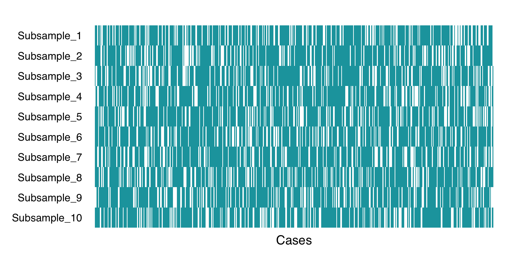

# Resampling {#resampling}


<STYLE type='text/css' scoped>
PRE.fansi SPAN {padding-top: .25em; padding-bottom: .25em};
</STYLE>


```r
library(rtemis)
```

```
  .:rtemis 0.8.1: Welcome, egenn
  [x86_64-apple-darwin17.0 (64-bit): Defaulting to 4/4 available cores]
  Documentation & vignettes: https://rtemis.lambdamd.org
```

**Resampling** refers to a collection of techniques for selecting cases from a sample. It is central to many machine learning algorithms and pipelines. The two core uses of resampling in predictive modeling / machinbe learning are **model selection (a.k.a. tuning)** and **model assessment**. By convention, we use the terms ***training*** and ***validation*** set when refering to model selection, and ***training*** and ***testing*** set when refering to model assessment. The terminology is unfortunately not intuitive and has led to much confusion. Some people reverse the terms, but we  use the terms training, validation, and testing as they are used in the [Elements of Statistical Learning](https://web.stanford.edu/~hastie/ElemStatLearn/) (p. 222, Second edition, 12th printing).

## Model Selection and Assessment

1. **Model Selection** aka **Hyperparameter tuning**  

Resamples of the training set are drawn creating multiple ***training*** and ***validation*** sets. For each resample, a combination of hyperparameters is used to train a model. The mean validation-set error across resamples is calculated. The combination of hyperparameters with the minimum loss on average across validation-set resamples is selected to train the full training sample. 

2. **Model assessment**  

Resamples of the full sample are drawn, resulting into multiple training - testing sets. A model is trained on each training set and its performance assessed on the corresponding test set. Model performance is averaged across all test sets.

**Nested resampling** or **nested crossvalidation** is the procedure where 1. and 2. are nested so that hyperparameter tuning (resampling of the training set) is performed within each of multiple training resamples and performance is tested in each corresponding test set. [elevate] performs automatic nested resampling and is one of the core supervised learning functions in **rtemis**.  

## The resample function

The `resample()` function is responsible for all resampling in **rtemis**.  


```r
x <- rnorm(500)
res <- resample(x)
```

<PRE class="fansi fansi-output"><CODE><span style='color: #555555;font-weight: bold;'>[[ </span><span style='font-weight: bold;'>Resampling Parameters</span><span style='color: #555555;font-weight: bold;'> ]]
</span><span>    n.resamples: 10 
      resampler: strat.sub 
   stratify.var: y 
        train.p: 0.75 
   strat.n.bins: 4 

</span><span style='color: #555555;'>[2020-11-09 01:08:35</span><span style='color: #555555;font-weight: bold;'> resample</span><span style='color: #555555;'>] </span><span>Created 10 stratified subsamples 
</span></CODE></PRE>

```r
class(res)
```

```
[1] "resample" "list"    
```

It outputs a list which is an S3 object of class `resample`, with print and plot methods.


```r
res
```

<PRE class="fansi fansi-output"><CODE><span style='font-weight: bold;'>.:rtemis</span><span> </span><span style='color: #BBBB00;font-weight: bold;'>resample object</span><span> 
              N: 10 
           type: strat.sub 
        train.p: 0.75 
   strat.n.bins: 4 
</span></CODE></PRE>

```r
plot(res)
```



The teal-colored lines represent the training cases selected for each resample, the white are testing cases (held out).  

`resample()` supports 5 types of resampling:  

1. **k-fold crossvalidation (Stratified)**   

You split the cases into k sets (folds). Each set is used once as the validation or testing set. This means each cases is left out exactly once and there is no overlap between different validation/test sets. In **rtemis**, the folds are also stratified by default on the outcome unless otherwise chosen. Stratification tries to maintain the full sample's distribution in both training and left-out sets. This is crucial for non-normally distributed continuous outcomes or [imbalanced datasets](#imbalanced). 10 is a common value for k, called 10-fold. Note that the size of the training and left-out sets depends on the sample size.


```r
res.10fold <- resample(x, 10, "kfold")
```

<PRE class="fansi fansi-output"><CODE><span style='color: #555555;font-weight: bold;'>[[ </span><span style='font-weight: bold;'>Resampling Parameters</span><span style='color: #555555;font-weight: bold;'> ]]
</span><span>    n.resamples: 10 
      resampler: kfold 
   stratify.var: y 
   strat.n.bins: 4 

</span><span style='color: #555555;'>[2020-11-09 01:08:35</span><span style='color: #555555;font-weight: bold;'> resample</span><span style='color: #555555;'>] </span><span>Created 10 independent folds 
</span></CODE></PRE>

2. **Stratified subsampling**  

Draw `n.resamples` stratified samples from the data given a certain probability (`train.p`) that each case belongs to the training set. Since you are randomly sampling from the full sample  each time, there will be overlap in the test set cases, but you control the training-to-testing ratio and number of resamples independently, unlike in k-fold resampling.

```r
res.25ss <- resample(x, 25, "strat.sub")
```

<PRE class="fansi fansi-output"><CODE><span style='color: #555555;font-weight: bold;'>[[ </span><span style='font-weight: bold;'>Resampling Parameters</span><span style='color: #555555;font-weight: bold;'> ]]
</span><span>    n.resamples: 25 
      resampler: strat.sub 
   stratify.var: y 
        train.p: 0.75 
   strat.n.bins: 4 

</span><span style='color: #555555;'>[2020-11-09 01:08:36</span><span style='color: #555555;font-weight: bold;'> resample</span><span style='color: #555555;'>] </span><span>Created 25 stratified subsamples 
</span></CODE></PRE>

3. **Bootstrap**  

The [bootstrap](https://en.wikipedia.org/wiki/Bootstrapping_(statistics)): random sampling with replacement. Since cases are replicated, you should use bootstrap as the outer resampler if you will also have inner resampling for tuning, since the same case may end up in both training and validation sets. 

```r
res.100boot <- resample(x, 100, "bootstrap")
```

<PRE class="fansi fansi-output"><CODE><span style='color: #555555;font-weight: bold;'>[[ </span><span style='font-weight: bold;'>Resampling Parameters</span><span style='color: #555555;font-weight: bold;'> ]]
</span><span>   n.resamples: 100 
     resampler: bootstrap 

</span><span style='color: #555555;'>[2020-11-09 01:08:36</span><span style='color: #555555;font-weight: bold;'> resample</span><span style='color: #555555;'>] </span><span>Created 100 bootstrap resamples 
</span></CODE></PRE>

4. **Stratified Bootstrap**  

This is stratified subsampling with random replication of cases to match the length of the original sample. Same as the bootstrap, do not use if you will be further resampling each resample.


```r
res.100sboot <- resample(x, 100, "strat.boot")
```

<PRE class="fansi fansi-output"><CODE><span style='color: #555555;font-weight: bold;'>[[ </span><span style='font-weight: bold;'>Resampling Parameters</span><span style='color: #555555;font-weight: bold;'> ]]
</span><span>     n.resamples: 100 
       resampler: strat.boot 
    stratify.var: y 
         train.p: 0.75 
    strat.n.bins: 4 
   target.length: 500 

</span><span style='color: #555555;'>[2020-11-09 01:08:36</span><span style='color: #555555;font-weight: bold;'> resample</span><span style='color: #555555;'>] </span><span>Created 100 stratified bootstraps 
</span></CODE></PRE>

5. **Leave-One-Out-Crossvalidation (LOOCV)**  

This is k-fold crossvalidation where $k = N$, where $N$ is number of data points/cases in the whole sample. It has been included for experimentation and completenes, but it is not recommended either for model selection or assessment over the other resampling methods.


```r
res.loocv <- resample(x, resampler = "loocv")
```

<PRE class="fansi fansi-output"><CODE><span style='color: #555555;font-weight: bold;'>[[ </span><span style='font-weight: bold;'>Resampling Parameters</span><span style='color: #555555;font-weight: bold;'> ]]
</span><span>   n.resamples: 500 
     resampler: loocv 

</span><span style='color: #555555;'>[2020-11-09 01:08:36</span><span style='color: #555555;font-weight: bold;'> resample</span><span style='color: #555555;'>] </span><span>Created 500 independent folds (LOOCV) 
</span></CODE></PRE>

## Example: Stratified vs random sampling in a binomial distribution

Imagine `y` is the outcome of interest where events occur with a probability of .1 - a common scenario in many fields.


```r
set.seed(2020)
x <- rbinom(100, 1, .1)
mplot3.x(x)
```


```r
freq <- table(x)
prob <- freq[2] / sum(freq)
res.nonstrat <- lapply(seq(10), function(i) sample(seq(x), .75*length(x)))
res.strat <- resample(x)
```

<PRE class="fansi fansi-output"><CODE><span style='color: #555555;font-weight: bold;'>[[ </span><span style='font-weight: bold;'>Resampling Parameters</span><span style='color: #555555;font-weight: bold;'> ]]
</span><span>    n.resamples: 10 
      resampler: strat.sub 
   stratify.var: y 
        train.p: 0.75 
   strat.n.bins: 4 
</span><span style='color: #555555;'>[2020-11-09 01:08:36</span><span style='color: #555555;font-weight: bold;'> strat.sub</span><span style='color: #555555;'>] </span><span>Using max n bins possible = 2 

</span><span style='color: #555555;'>[2020-11-09 01:08:36</span><span style='color: #555555;font-weight: bold;'> resample</span><span style='color: #555555;'>] </span><span>Created 10 stratified subsamples 
</span></CODE></PRE>

```r
prob.nonstrat <- sapply(seq(10), function(i) {
  freq <- table(x[res.nonstrat[[i]]])
  freq[2]/sum(freq)
})
prob.strat <- sapply(seq(10), function(i) {
  freq <- table(x[res.strat[[i]]])
  freq[2]/sum(freq)
})
prob.nonstrat
```

```
         1          1          1          1          1          1          1 
0.09333333 0.08000000 0.08000000 0.06666667 0.06666667 0.10666667 0.10666667 
         1          1          1 
0.10666667 0.09333333 0.08000000 
```

```r
sd(prob.nonstrat)
```

```
[1] 0.0156505
```

```r
prob.strat
```

```
         1          1          1          1          1          1          1 
0.08108108 0.08108108 0.08108108 0.08108108 0.08108108 0.08108108 0.08108108 
         1          1          1 
0.08108108 0.08108108 0.08108108 
```

```r
sd(prob.strat)
```

```
[1] 0
```

As expected, the random sampling resulted in different event probability in each resample, whereas stratified subsampling maintained a constant probability across resamples.
