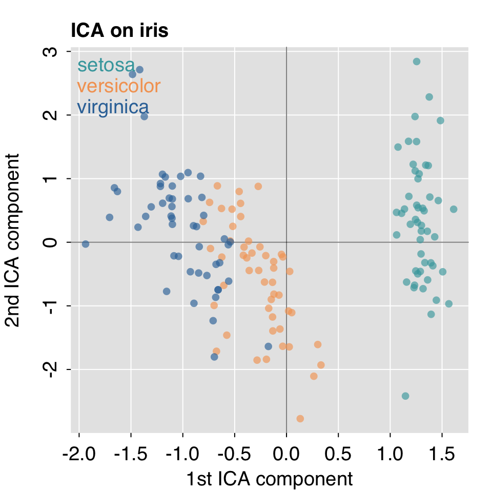
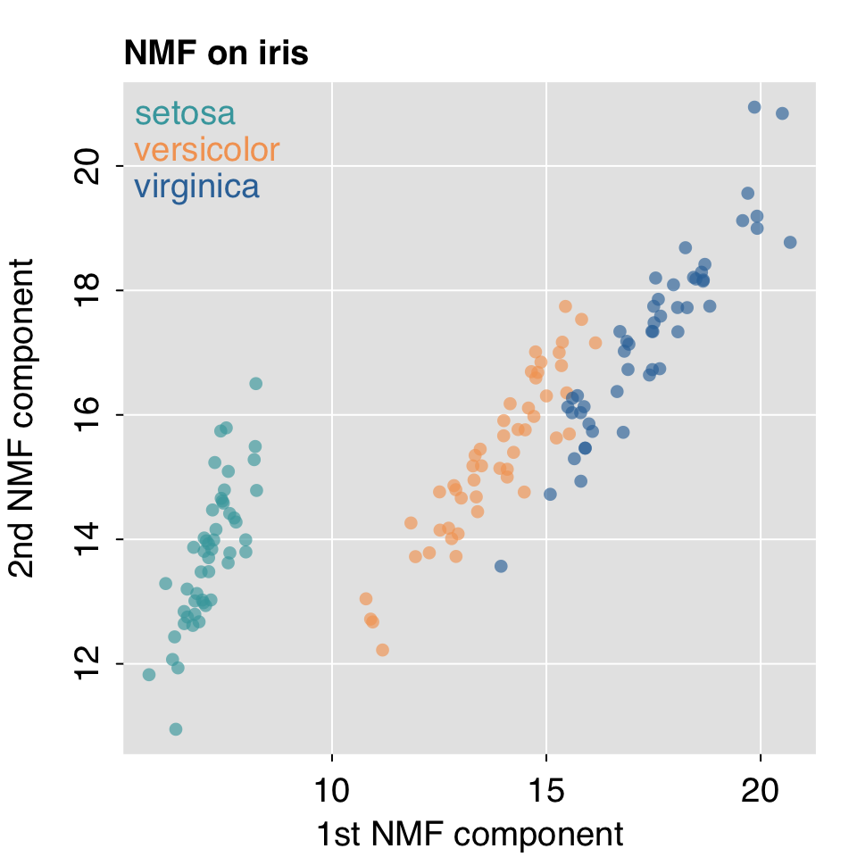
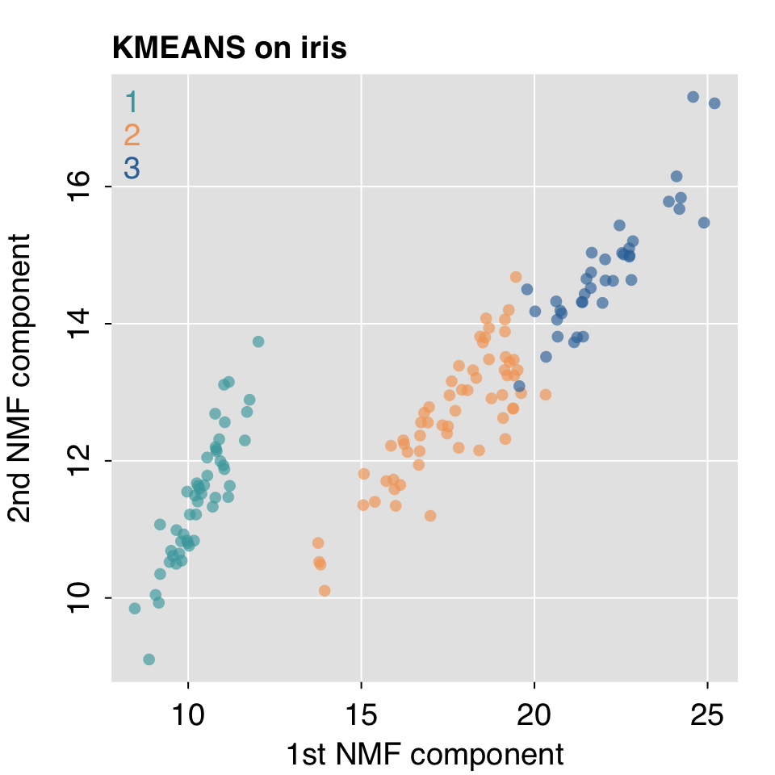
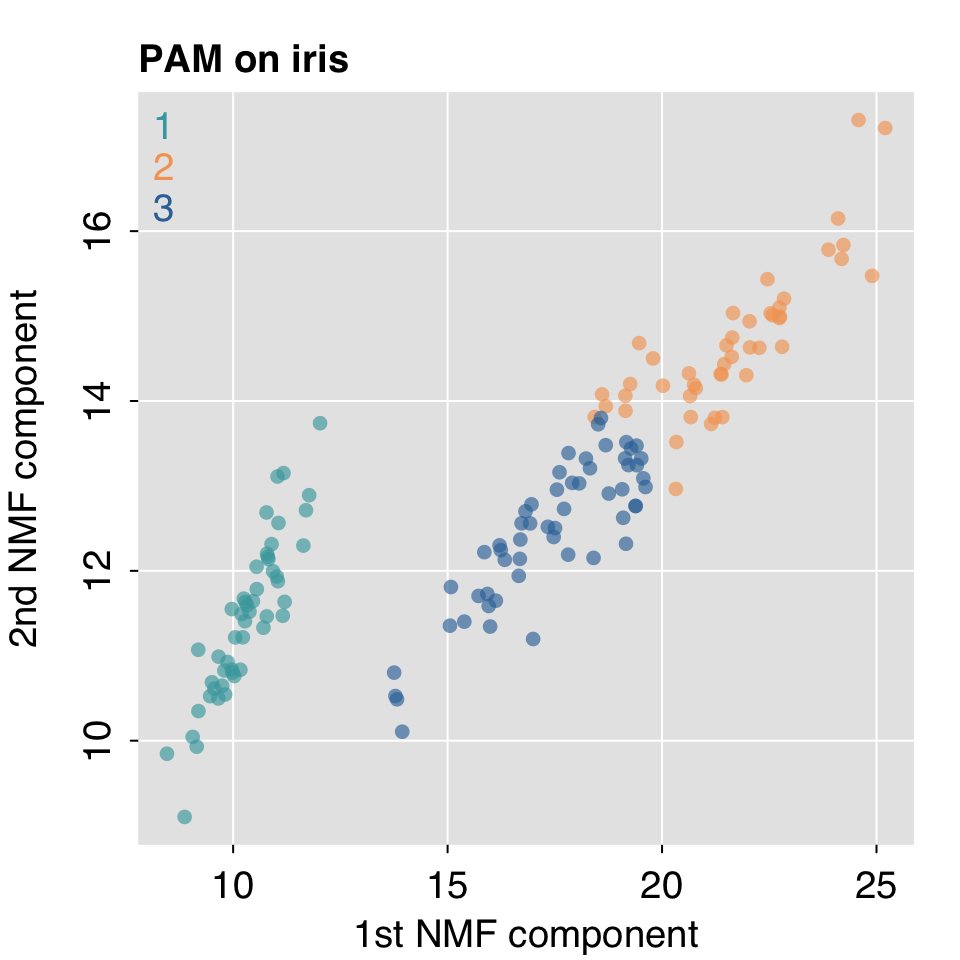

# Unsupervised Learning {#unsupervised}


<STYLE type='text/css' scoped>
PRE.fansi SPAN {padding-top: .25em; padding-bottom: .25em};
</STYLE>


```
  .:rtemis 0.8.1: Welcome, egenn
  [x86_64-apple-darwin17.0 (64-bit): Defaulting to 4/4 available cores]
  Documentation & vignettes: https://rtemis.lambdamd.org
```

Unsupervised learning aims to learn relationships within a dataset without focusing at a particular outcome. You will often hear of unsupervised learning being performed on unlabeled data. To be clear, it means it does not use the labels to guide learning - whether labels are available or not. You might, for example, perform unsupervised learning ahead of supervised learning as we shall see later. Unsupervised learning includes a number of approaches, most of which can be divided into two categories:

* __Clustering__: Cases are grouped together based on some derived measure of similarity / distance metric.
* __Dimensionality Reduction / Matrix decomposition__: Variables are combined / projected into a lower dimensional space.

In **rtemis**, clustering algorithms begin with `u.` and decomposition/dimensionality reduction algorithms begin with `d.` (We use `u.` because `c.` is reserved for the builtin R function)

## Decomposition / Dimensionality Reduction {#decomposition}

Use `decomSelect()` to get a listing of available decomposition algorithms:

```r
decomSelect()
```

```
.:decomSelect
rtemis supports the following decomposition algorithms:

    Name                                   Description
     CUR                      CUR Matrix Approximation
   H2OAE                               H2O Autoencoder
 H2OGLRM                H2O Generalized Low-Rank Model
     ICA                Independent Component Analysis
  ISOMAP                                        ISOMAP
    KPCA           Kernel Principal Component Analysis
     LLE                      Locally Linear Embedding
     MDS                      Multidimensional Scaling
     NMF             Non-negative Matrix Factorization
     PCA                  Principal Component Analysis
    SPCA           Sparse Principal Component Analysis
     SVD                  Singular Value Decomposition
    TSNE   t-distributed Stochastic Neighbor Embedding
    UMAP Uniform Manifold Approximation and Projection
```

We can further divide decomposition algorithms into linear (e.g. PCA, ICA, NMF) and nonlinear dimensionality reduction, (also called manifold learning, like LLE and tSNE).

#### Principal Component Analysic (PCA)


```r
x <- iris[, 1:4]
iris.PCA <- d.PCA(x)
```

<PRE class="fansi fansi-output"><CODE><span style='color: #555555;'>[2020-11-09 01:08:54</span><span style='color: #555555;font-weight: bold;'> d.PCA</span><span style='color: #555555;'>] Hello,</span><span> </span><span style='color: #555555;'>egenn</span><span> 
</span><span style='color: #555555;'>[2020-11-09 01:08:54</span><span style='color: #555555;font-weight: bold;'> d.PCA</span><span style='color: #555555;'>] </span><span>||| Input has dimensions 150 rows by 4 columns, 
</span><span style='color: #555555;'>[2020-11-09 01:08:54</span><span style='color: #555555;font-weight: bold;'> d.PCA</span><span style='color: #555555;'>] </span><span>    interpreted as 150 cases with 4 features. 
</span><span style='color: #555555;'>[2020-11-09 01:08:54</span><span style='color: #555555;font-weight: bold;'> d.PCA</span><span style='color: #555555;'>] </span><span>Performing Principal Component Analysis... 

</span><span style='color: #555555;'>[2020-11-09 01:08:54</span><span style='color: #555555;font-weight: bold;'> d.PCA</span><span style='color: #555555;'>] Run completed in 4.3e-04 minutes (Real: 0.03; User: 0.01; System: 1e-03)</span><span> 
</span></CODE></PRE>

```r
mplot3.xy(iris.PCA$projections.train[, 1], iris.PCA$projections.train[, 2], group = iris$Species,
          xlab = "1st PCA component", ylab = "2nd PCA component", main = "PCA on iris")
```


#### Independent Component Analysis (ICA)


```r
iris.ICA <- d.ICA(x, k = 2)
```

<PRE class="fansi fansi-output"><CODE><span style='color: #555555;'>[2020-11-09 01:08:54</span><span style='color: #555555;font-weight: bold;'> d.ICA</span><span style='color: #555555;'>] Hello,</span><span> </span><span style='color: #555555;'>egenn</span><span> 
</span><span style='color: #555555;'>[2020-11-09 01:08:54</span><span style='color: #555555;font-weight: bold;'> d.ICA</span><span style='color: #555555;'>] </span><span>||| Input has dimensions 150 rows by 4 columns, 
</span><span style='color: #555555;'>[2020-11-09 01:08:54</span><span style='color: #555555;font-weight: bold;'> d.ICA</span><span style='color: #555555;'>] </span><span>    interpreted as 150 cases with 4 features. 
</span><span style='color: #555555;'>[2020-11-09 01:08:54</span><span style='color: #555555;font-weight: bold;'> d.ICA</span><span style='color: #555555;'>] </span><span>Running Independent Component Analysis... 

</span><span style='color: #555555;'>[2020-11-09 01:08:54</span><span style='color: #555555;font-weight: bold;'> d.ICA</span><span style='color: #555555;'>] Run completed in 3.5e-04 minutes (Real: 0.02; User: 0.01; System: 3e-03)</span><span> 
</span></CODE></PRE>

```r
mplot3.xy(iris.ICA$projections.train[, 1], iris.ICA$projections.train[, 2], group = iris$Species,
          xlab = "1st ICA component", ylab = "2nd ICA component", main = "ICA on iris")
```



#### Non-negative Matrix Factorization (NMF)


```r
iris.NMF <- d.NMF(x, k = 2)
```

<PRE class="fansi fansi-output"><CODE><span style='color: #555555;'>[2020-11-09 01:08:54</span><span style='color: #555555;font-weight: bold;'> d.NMF</span><span style='color: #555555;'>] Hello,</span><span> </span><span style='color: #555555;'>egenn</span><span> 
</span><span style='color: #555555;'>[2020-11-09 01:08:56</span><span style='color: #555555;font-weight: bold;'> d.NMF</span><span style='color: #555555;'>] </span><span>||| Input has dimensions 150 rows by 4 columns, 
</span><span style='color: #555555;'>[2020-11-09 01:08:56</span><span style='color: #555555;font-weight: bold;'> d.NMF</span><span style='color: #555555;'>] </span><span>    interpreted as 150 cases with 4 features. 
</span><span style='color: #555555;'>[2020-11-09 01:08:56</span><span style='color: #555555;font-weight: bold;'> d.NMF</span><span style='color: #555555;'>] </span><span>Running Non-negative Matrix Factorization... 

</span><span style='color: #555555;'>[2020-11-09 01:08:58</span><span style='color: #555555;font-weight: bold;'> d.NMF</span><span style='color: #555555;'>] Run completed in 0.06 minutes (Real: 3.58; User: 2.98; System: 0.13)</span><span> 
</span></CODE></PRE>

```r
mplot3.xy(iris.NMF$projections.train[, 1], iris.NMF$projections.train[, 2], group = iris$Species,
          xlab = "1st NMF component", ylab = "2nd NMF component", main = "NMF on iris")
```



## Clustering

Use `clustSelect()` to get a listing of available clustering algorithms:

```r
clustSelect()
```

```
.:clustSelect
rtemis supports the following clustering algorithms:

      Name                                             Description
    CMEANS                                Fuzzy C-means Clustering
       EMC                     Expectation Maximization Clustering
    HARDCL                               Hard Competitive Learning
    HOPACH Hierarchical Ordered Partitioning And Collapsing Hybrid
 H2OKMEANS                                  H2O K-Means Clustering
    KMEANS                                      K-Means Clustering
      NGAS                                   Neural Gas Clustering
       PAM                             Partitioning Around Medoids
      PAMK           Partitioning Around Medoids with k estimation
      SPEC                                     Spectral Clustering
```

Let's cluster iris and we shall also use an NMF decomposition as we saw above to project to 2 dimensions.  
We'll use two of the most popular clustering algorithms, K-means and PAM, aka K-medoids.


```r
x <- iris[, 1:4]
iris.NMF <- d.NMF(x, k = 2)
```

<PRE class="fansi fansi-output"><CODE><span style='color: #555555;'>[2020-11-09 01:08:58</span><span style='color: #555555;font-weight: bold;'> d.NMF</span><span style='color: #555555;'>] Hello,</span><span> </span><span style='color: #555555;'>egenn</span><span> 
</span><span style='color: #555555;'>[2020-11-09 01:08:58</span><span style='color: #555555;font-weight: bold;'> d.NMF</span><span style='color: #555555;'>] </span><span>||| Input has dimensions 150 rows by 4 columns, 
</span><span style='color: #555555;'>[2020-11-09 01:08:58</span><span style='color: #555555;font-weight: bold;'> d.NMF</span><span style='color: #555555;'>] </span><span>    interpreted as 150 cases with 4 features. 
</span><span style='color: #555555;'>[2020-11-09 01:08:58</span><span style='color: #555555;font-weight: bold;'> d.NMF</span><span style='color: #555555;'>] </span><span>Running Non-negative Matrix Factorization... 

</span><span style='color: #555555;'>[2020-11-09 01:08:59</span><span style='color: #555555;font-weight: bold;'> d.NMF</span><span style='color: #555555;'>] Run completed in 0.01 minutes (Real: 0.88; User: 0.76; System: 0.05)</span><span> 
</span></CODE></PRE>

### K-Means


```r
iris.KMEANS <- u.KMEANS(x, k = 3)
```

<PRE class="fansi fansi-output"><CODE><span style='color: #555555;'>[2020-11-09 01:08:59</span><span style='color: #555555;font-weight: bold;'> u.KMEANS</span><span style='color: #555555;'>] Hello,</span><span> </span><span style='color: #555555;'>egenn</span><span> 
</span><span style='color: #555555;'>[2020-11-09 01:08:59</span><span style='color: #555555;font-weight: bold;'> u.KMEANS</span><span style='color: #555555;'>] </span><span>Performing K-means Clustering with k = 3... 

</span><span style='color: #555555;'>[2020-11-09 01:08:59</span><span style='color: #555555;font-weight: bold;'> u.KMEANS</span><span style='color: #555555;'>] Run completed in 0.01 minutes (Real: 0.37; User: 0.26; System: 0.02)</span><span> 
</span></CODE></PRE>

```r
mplot3.xy(iris.NMF$projections.train[, 1], iris.NMF$projections.train[, 2],
          group = iris.KMEANS$clusters.train,
          xlab = "1st NMF component", ylab = "2nd NMF component", main = "KMEANS on iris")
```



### Partitioning Around Medoids with k estimation (PAMK)


```r
iris.pamk <- u.PAMK(x, krange = 3:10)
```

<PRE class="fansi fansi-output"><CODE><span style='color: #555555;'>[2020-11-09 01:09:00</span><span style='color: #555555;font-weight: bold;'> u.PAMK</span><span style='color: #555555;'>] Hello,</span><span> </span><span style='color: #555555;'>egenn</span><span> 
</span><span style='color: #555555;'>[2020-11-09 01:09:01</span><span style='color: #555555;font-weight: bold;'> u.PAMK</span><span style='color: #555555;'>] </span><span>Partitioning Around Medoids... 
</span><span style='color: #555555;'>[2020-11-09 01:09:01</span><span style='color: #555555;font-weight: bold;'> u.PAMK</span><span style='color: #555555;'>] </span><span>Estimated optimal number of clusters: 3 

</span><span style='color: #555555;'>[2020-11-09 01:09:01</span><span style='color: #555555;font-weight: bold;'> u.PAMK</span><span style='color: #555555;'>] Run completed in 0.02 minutes (Real: 1.04; User: 0.80; System: 0.05)</span><span> 
</span></CODE></PRE>

```r
mplot3.xy(iris.NMF$projections.train[, 1], iris.NMF$projections.train[, 2],
          group = iris.pamk$clusters.train,
          xlab = "1st NMF component", ylab = "2nd NMF component", main = "PAM on iris")
```


