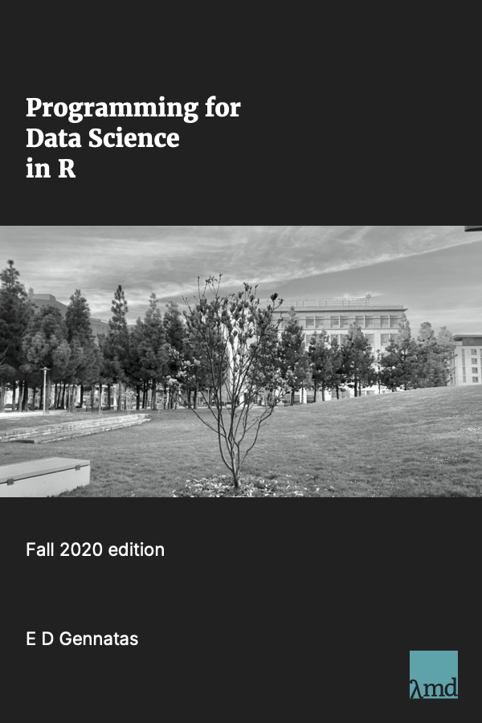

--- 
title: "Programming for Data Science in R"
author: "Efstathios (Stathis) D. Gennatas, MBBS AICSM PhD"
date: "`r Sys.Date()`"
site: bookdown::bookdown_site
output: bookdown::bs4_book
documentclass: book
bibliography: [book.bib, packages.bib]
biblio-style: apalike
link-citations: yes
links-as-notes: true
description: "Programming for Data Science in R is a project to build an online resource for (Bio)statisticians / Epidemiologists / (Health) Data Scientists"
---

```{r include=FALSE}
# automatically create a bib database for R packages
knitr::write_bib(c(
  .packages(), 'bookdown', 'knitr', 'rmarkdown'
), 'packages.bib')
```

# PDSR {-}


<br/><br/>
Welcome to PDSR!  
This book is aimed as an introductory- to intermediate-level R programming learning resource.  
It is the online book for UCSF Biostat 213/4, currently being updated regularly.  

EDG  
[UCSF](https://www.ucsf.edu/) [LCM](https://lambdamd.org/),  
San Francisco, CA, July 2021
